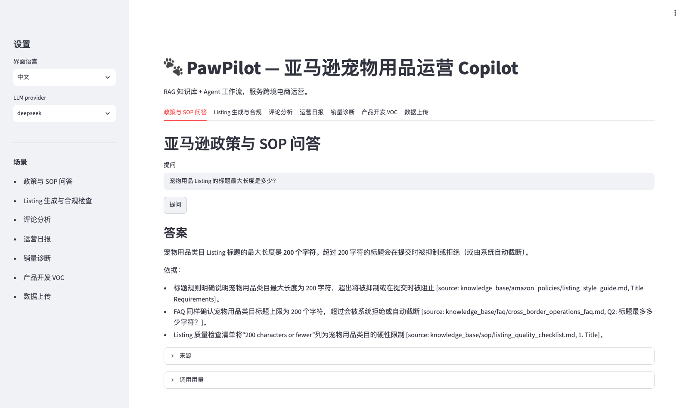
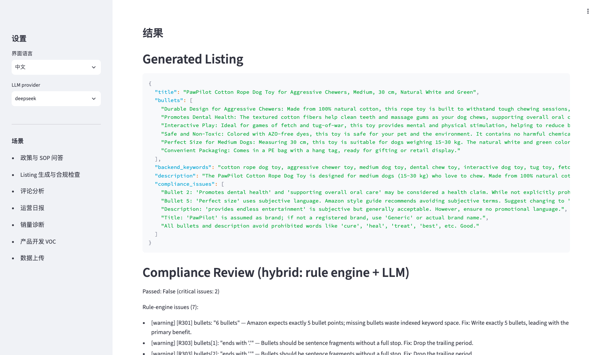
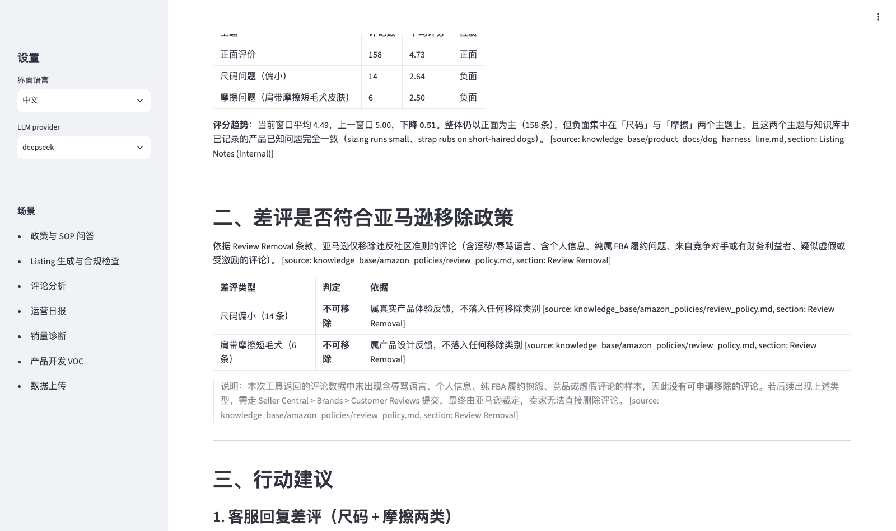
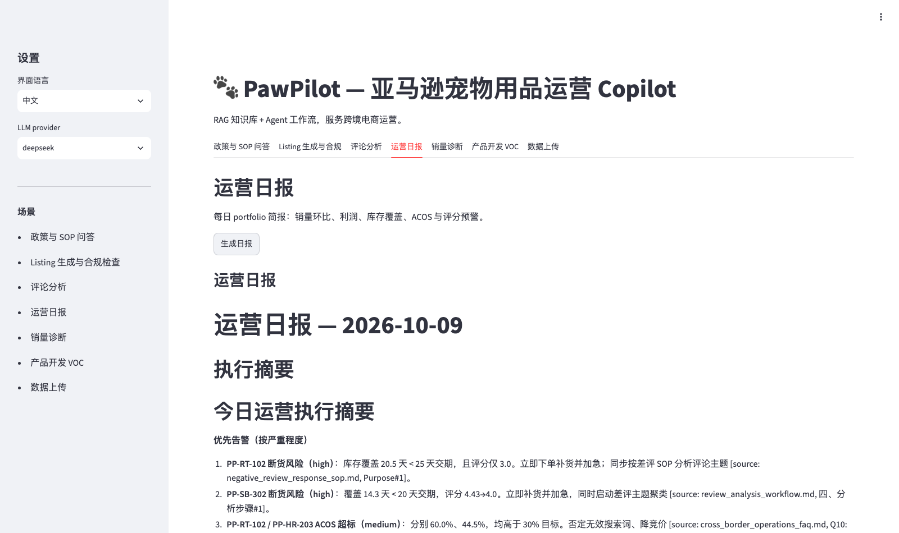
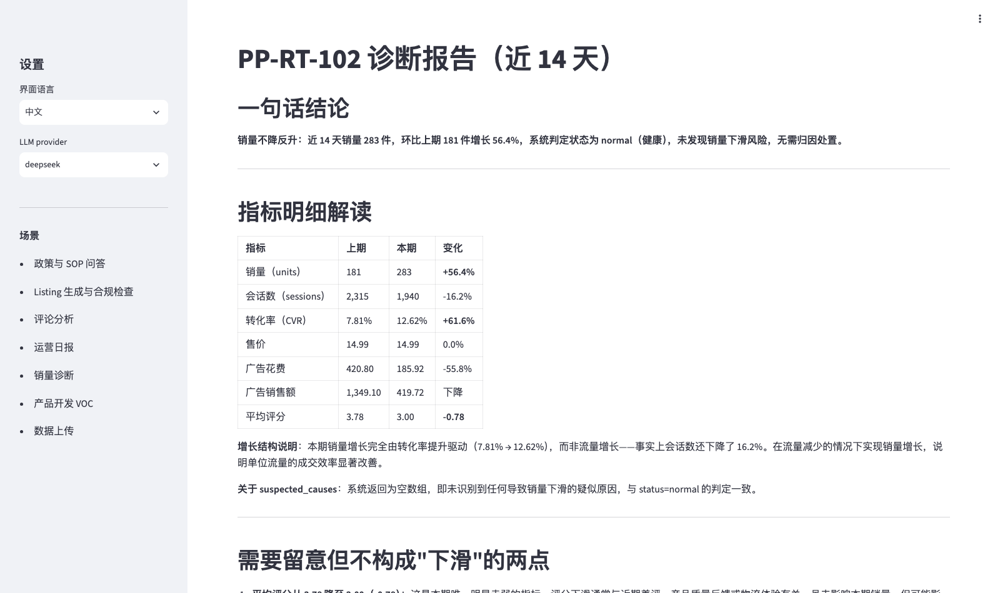
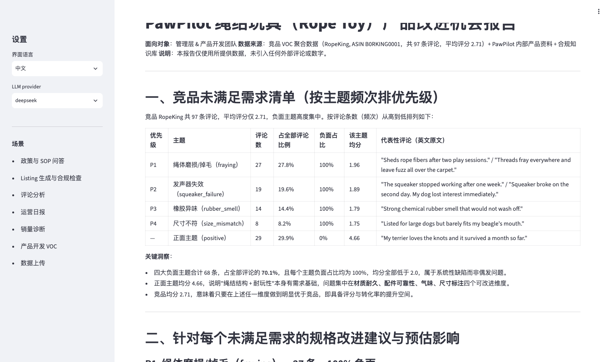
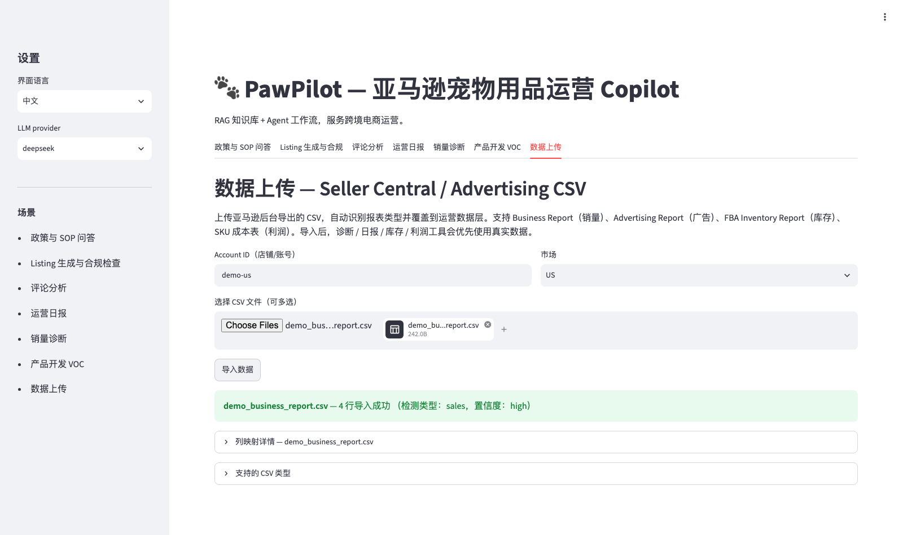
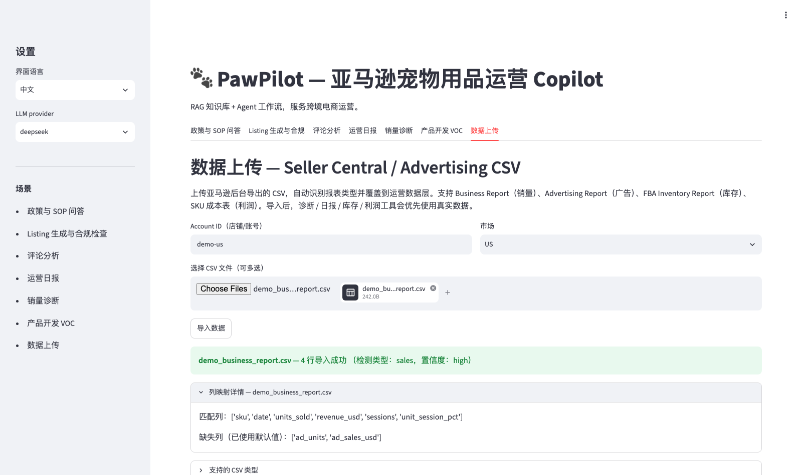
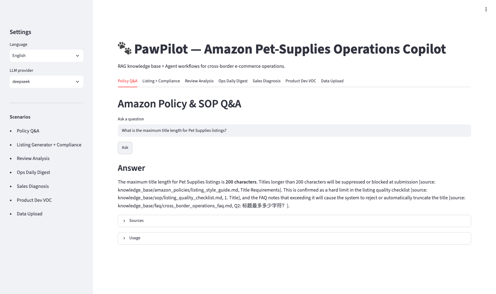

# 🐾 PawPilot — 亚马逊宠物用品运营 Copilot

[](https://github.com/Peterwong666/pawpilot/actions/workflows/ci.yml)
[](https://www.python.org/)
[](LICENSE)

**语言 / Language：** [中文（默认）](#中文文档) ｜ [English](#english-documentation)

PawPilot 是一个面向亚马逊跨境电商运营的**企业级 RAG 知识库 + Agent 工作流**系统，
覆盖从知识入库、混合检索、Agent 工具编排、离线评测到 Docker 部署的完整 AI 应用交付链路。



> **真实业务背景。** 作者曾在亚马逊美国站运营宠物用品，单品进入类目 Top 20，月 GMV 约
> $120K，ACOS 从 38% 优化至 26%。PawPilot 把这段运营经验沉淀为一套可复现、可测试、
> 开源的 AI 系统，而不是又一个「聊 PDF 的玩具 Demo」。

---

<a id="中文文档"></a>
# 📖 中文文档

## 目录

- [项目定位](#项目定位)
- [功能特性与效果展示](#功能特性与效果展示)
- [系统架构](#系统架构)
- [快速开始](#快速开始)
- [导入真实店铺数据](#导入真实店铺数据)
- [评测体系](#评测体系)
- [MCP 服务接入](#mcp-服务接入)
- [项目结构](#项目结构)
- [工程实践与踩坑记录](#工程实践与踩坑记录)
- [AI 原生开发流程](#ai-原生开发流程)
- [Roadmap](#roadmap)
- [许可证与联系方式](#许可证与联系方式)

## 项目定位

市面上大多数「RAG Demo」止步于一个能聊天的问答框。而一名全栈开发工程师（FDE）需要交付的远不止于此：

- 能否跑通**完整 RAG 链路**（解析 → 切块 → 嵌入 → 检索 → 重排序 → 引用生成）？
- 能否说清**为什么**选这个向量库、这套 Agent 框架，而不是另一个？
- 能否用**离线评测指标**（而不是「我看着挺准」）证明系统有效？
- 能否把同一套能力封装成 **MCP 工具**，供 Claude Code / Cursor 等外部 Agent 调用？
- 能否以 **Docker 服务 + CI + 运维手册**的形态交付上线？

PawPilot 对以上每一个问题给出了工程化的答案。

## 功能特性与效果展示

基于真实运营场景构建 **7 大功能模块**，其中分析类场景默认中文输出，支持侧边栏一键切换中英文界面。

### 1. 政策与 SOP 问答

基于知识库的亚马逊政策 / 合规 / 评论 / 账户健康问答。答案由向量 + 关键词混合检索支撑，
逐条标注来源文档与章节，可展开核对原文与 Token 用量。


### 2. Listing 生成与合规检查

输入产品事实（SKU、材质、尺寸、卖点等），一键生成英文标题、五点描述、Search Terms 与长描述，
随后由**规则引擎 + LLM 混合引擎**扫描违禁词、未经证实的功效宣称和风格问题，输出分级（critical / warning）修改建议。



### 3. 评论分析

按 SKU + 时间窗口聚合评论，输出主题分布表、评分趋势、差评是否符合亚马逊移除政策的判定，
并结合公司 SOP 给出客服回复与产品改进行动建议。



### 4. 运营日报

一键生成 portfolio 级简报：销量环比、利润、库存覆盖、ACOS、评分预警，附按严重程度排序的
中文执行摘要，每条结论均引用 SOP 知识库来源。



### 5. 销量诊断

把某个 SKU 的单量异动量化归因到广告预算、自然流量、转化率、评分或价格变化：
上期 vs 本期指标对照表 + 增长结构解读 + 是否构成「下滑」的判定结论。



### 6. 产品开发 VOC

挖掘竞品评论中的未满足需求，按主题频次、负面占比、均分排优先级，附代表性英文原评、
关键洞察，以及结合成本结构的规格改进建议与预估影响。



### 7. 数据上传（真实 CSV 接入）

上传 Seller Central / Advertising Console 导出的 CSV，系统自动识别 4 类报表、
完成列名映射与值清洗（`$`、`,`、`%`），按 `(账号, 站点, SKU, 日期)` 合并存储，
天然支持多账号 / 多店铺数据汇总。



导入后展示置信度与逐列映射详情；导入的真实数据按 **SKU + 日期**精确覆盖模拟数据，
未覆盖日期自动回退模拟数据，所有分析工具无需改动即读取混合数据。



### 8. 中英双语界面

界面语言与 LLM 提供方均可在侧边栏切换，默认中文。



## 系统架构

```text
┌────────────────────────────────────────────────────────────────────┐
│  Streamlit Demo UI（7 大模块，中英双语切换）                            │
├────────────────────────────────────────────────────────────────────┤
│  FastAPI API                                                        │
│  /api/ask          → 纯 RAG 政策问答                                  │
│  /api/listing      → Agent Listing 生成 + 混合合规检查                │
│  /api/reviews      → Agent 评论分析（中文）                           │
│  /api/digest       → Portfolio 运营日报（中文）                       │
│  /api/diagnose     → 销量异动归因（中文）                             │
│  /api/product-dev  → 竞品 VOC 产品改进（中文）                        │
│  /api/import-csv   → Seller Central / Advertising CSV 导入           │
├──────────────────────────┬─────────────────────────────────────────┤
│  自研 Agent 运行时         │  FastMCP Server（10 个工具）              │
│  • 工具调用循环            │  search_policies                         │
│  • 对话记忆                │  check_listing_compliance                │
│  • 最大迭代次数护栏        │  query_sales_data                        │
│  • 超时与重试              │  analyze_reviews                         │
│                           │  get_product_info                        │
│                           │  diagnose_sales_anomaly                  │
│                           │  analyze_profit                          │
│                           │  check_inventory_health                  │
│                           │  mine_competitor_reviews                 │
│                           │  generate_daily_digest                   │
├──────────────────────────┴─────────────────────────────────────────┤
│  RAG 管线                                                            │
│  入库：Markdown → 清洗 → 标题感知切块 → Embedding → pgvector           │
│  检索：向量检索 + 关键词检索 → RRF 融合 → Rerank 重排序                │
│  生成：Prompt 组装 + 引用标注 + JSON Mode                              │
├────────────────────────────────────────────────────────────────────┤
│  PostgreSQL + pgvector（向量 + 运营业务表，存放真实导入 CSV）           │
│  DuckDB（模拟销量 / 评论 / 广告 / 成本 / 库存 / 竞品评论，              │
│           由真实导入按 SKU+日期叠加覆盖）                              │
└────────────────────────────────────────────────────────────────────┘
```

### 技术选型

| 层 | 选型 | 理由 |
|---|---|---|
| 向量库 | **pgvector** | 单容器 Postgres 即可同时承载元数据与关键词索引，运维简单。详见 [ADR-001](docs/adr/001-why-pgvector-not-milvus.md)。 |
| Agent 运行时 | **自研 Python 循环** | 完整展示工具循环、状态管理、护栏与 MCP 复用。详见 [ADR-002](docs/adr/002-why-self-built-agent-runtime.md)。 |
| LLM | **DeepSeek + Qwen** | 高性价比、OpenAI 兼容接口、支持中英文场景。详见 [ADR-003](docs/adr/003-why-deepseek-plus-qwen.md)。 |
| Embedding / Rerank | **SiliconFlow BGE** | `bge-m3` + `bge-reranker-v2-m3`，提供免费额度。 |
| 数据层 | **PostgreSQL + DuckDB** | 真实 Seller Central / Advertising CSV 按多账号存 Postgres；`HybridDataStore` 按 SKU+日期叠加到 DuckDB 模拟数据集，无真实数据处自动回退。 |
| UI | **Streamlit** | 最低成本交付可点击的完整演示。 |
| 工程化 | **uv + ruff + mypy + pytest + GitHub Actions** | 现代化 Python 工程工作流。 |

## 快速开始

### 环境要求

- Python ≥ 3.12、[uv](https://docs.astral.sh/uv/)
- Docker（用于启动 PostgreSQL + pgvector）
- DeepSeek / 通义千问 API Key（任一）与 SiliconFlow API Key（嵌入 / 重排序）

### 1. 克隆仓库并配置环境变量

```bash
git clone https://github.com/Peterwong666/pawpilot.git
cd pawpilot
cp .env.example .env
# 在 .env 中填入 DEEPSEEK_API_KEY（或 DASHSCOPE_API_KEY）与 SILICONFLOW_API_KEY
```

### 2. 启动 PostgreSQL + pgvector

```bash
docker compose -f docker/docker-compose.yml up -d
# 若本机 Docker 不支持 compose 子命令，可改用：docker-compose -f docker/docker-compose.yml up -d
```

### 3. 安装依赖

```bash
uv sync
```

### 4. 入库知识库

```bash
uv run python scripts/ingest.py
```

### 5. 启动 API

```bash
uv run uvicorn app.api.main:app --reload
```

打开 `http://localhost:8000/docs` 可查看交互式 API 文档。

### 6. 启动 Streamlit 界面

```bash
uv run streamlit run web/app.py
```

打开 `http://localhost:8501`，在侧边栏选择语言与 LLM 提供方即可开始体验。

### Docker 一键部署全栈

```bash
docker compose -f docker/docker-compose.full.yml up -d --build
```

- API：`http://localhost:8000`
- Web UI：`http://localhost:8501`
- 健康检查与烟囱测试：`./scripts/docker_smoke_test.sh`

Compose 文件负责启动顺序（db → api → web 的健康检查门控）并自动完成知识库入库。
详见 [docs/deployment.md](docs/deployment.md)。

## 导入真实店铺数据

通过 UI 的**数据上传**标签页，或直接调用 API：

```bash
curl -X POST http://localhost:8000/api/import-csv \
  -F "file=@business_report.csv" \
  -F "account_id=my-shop" \
  -F "marketplace=US"
```

- **自动识别 4 类报表**：Business Report（销量）、Advertising Report（广告）、FBA Inventory Report（库存）、SKU 成本表。
- **表头别名映射**：兼容后台导出的各种列名；自动清洗 `$`、千分位、百分号；日期统一 ISO 格式（`2024-10-01`）。
- **多账号合并**：按 `(account_id, marketplace, sku, date)` 唯一键 upsert，不同店铺自动汇总。
- **混合数据层**：导入值按 SKU+日期精确覆盖模拟值；诊断 / 日报 / 库存 / 利润工具自动优先读取真实数据。

## 评测体系

PawPilot 内置离线评测框架：

- **100+ 条种子 QA**，覆盖政策问答、Listing 合规、评论分析（[eval/dataset.jsonl](eval/dataset.jsonl)）。
- **确定性检索指标**：Recall@k、MRR、nDCG@k。
- **LLM-as-judge 生成指标**：回答准确性、幻觉评分。
- **对比实验**：不同切块策略、检索模式与模型提供方。

```bash
uv run python eval/runner.py
```

示例输出：

```json
{
  "overall": {
    "recall_at_k": 0.87,
    "mrr": 0.78,
    "ndcg_at_k": 0.81,
    "answer_score": 0.84,
    "hallucination_score": 0.08
  }
}
```

完整的改进报告（产品开发 / 运营痛点、方案决策与前后对比）见
[docs/fde-improvement-report.md](docs/fde-improvement-report.md)。

## MCP 服务接入

同一套工具逻辑通过 FastMCP 暴露为标准 MCP Server：

```bash
uv run python -m app.mcp_server.server
```

在 Claude Code / Cursor 中配置：

```json
{
  "mcpServers": {
    "pawpilot": {
      "command": "uv",
      "args": ["run", "--", "python", "-m", "app.mcp_server.server"],
      "env": {
        "DEEPSEEK_API_KEY": "...",
        "SILICONFLOW_API_KEY": "..."
      }
    }
  }
}
```

随后即可用自然语言驱动：*「查一下宠物用品标题长度规则」*、*「帮我诊断 PP-RT-102 单量为什么掉了」*、
*「生成今天的运营日报」*、*「挖一下绳玩具竞品评论里的差评机会」*。

## 项目结构

```text
.
├── app/
│   ├── agent/            # 工具注册中心 + 自研 Agent 运行时
│   ├── api/              # FastAPI 应用
│   ├── core/             # 配置与 LLM 客户端
│   ├── data/             # DuckDB 模拟数据 + CSV 导入管线
│   ├── mcp_server/       # FastMCP Server
│   ├── rag/              # 入库 / 检索 / 生成
│   └── scenarios/        # 政策问答 / Listing / 评论分析等场景
├── data/
│   ├── knowledge_base/   # Markdown 政策、SOP、产品文档、FAQ
│   └── simulated/        # 生成的销量 / 评论 / 广告模拟数据
├── docker/               # Docker Compose 文件
├── docs/
│   ├── adr/              # 架构决策记录（ADR）
│   ├── images/           # README 截图
│   ├── deployment.md
│   └── ops_sop.md
├── eval/                 # 评测数据集、生成器、运行器
├── scripts/              # 入库、烟囱测试等脚本
├── tests/                # pytest 测试套件
├── web/                  # Streamlit UI + i18n
└── pyproject.toml
```

## 工程实践与踩坑记录

| # | 问题 | 根因 | 解决方案 |
|---|---|---|---|
| 1 | 政策问答偶尔定位不到具体章节 | 层级切块在任意边界切断长章节 | 引入标题感知切块 + RRF 融合，让关键词检索可召回正确章节。 |
| 2 | 合规检查能抓 "antibacterial" 却漏掉 "FDA certified" | 泛化扫描提示词使模型只关注明显违禁词 | 在合规提示词中枚举显式规则类别。 |
| 3 | Agent 偶尔用相似查询重复调用工具 | 缺少对历史工具结果的短期记忆 | 增加对话记忆与最大迭代次数护栏。 |
| 4 | 导入部分日期的真实 CSV 后，窗口查询返回 NaN | 按 SKU 整体抹除模拟数据，未覆盖日期出现空洞 | 混合层改为按 (SKU, 日期) 遮罩：真实数据优先，其余日期回退模拟值。 |
| 5 | 中文界面下产品开发 VOC 接口 500 | UI 把本地化选项（「绳玩具」）直接发给只接受英文枚举的 API | 下拉框选项改用英文枚举值、显示走 `format_func` 翻译，载荷与界面语言解耦。 |

这些都是真实的调试决策记录，而非事后包装。

## AI 原生开发流程

本项目在开发过程中重度使用 **Claude Code / Trae** 作为主力编程助手：

- 约 70% 的代码脚手架由 AI 生成或经 AI review；
- 架构决策、提示词设计、评测标准、合规判定由人工把关；
- 每个模块都有单元测试，检索指标完全可复现。

目标不是掩盖 AI 的使用，而是展示 FDE 如何驾驭 AI 编程工具，更快地交付生产形态的代码。

## Roadmap

- [x] 评测数据集扩充至 100+ 条 QA
- [x] 真实店铺 CSV 数据接入（Seller Central / Advertising）
- [x] 分析场景中文输出
- [x] UI 中英文一键切换
- [ ] UI 内多模型对比报告
- [ ] Langfuse / OpenTelemetry 链路追踪
- [ ] Streamlit 趋势图表与库存看板

## 许可证与联系方式

基于 [MIT License](LICENSE) 开源。

由 [Peterwong666](https://github.com/Peterwong666) 作为 FDE 作品集项目构建，
欢迎通过 GitHub Issues 交流想法与反馈。

---

<a id="english-documentation"></a>
# 📖 English Documentation

## Table of Contents

- [Overview](#overview)
- [Features & Screenshots](#features--screenshots)
- [Architecture](#architecture)
- [Quick Start](#quick-start)
- [Import Real Seller Data](#import-real-seller-data)
- [Evaluation](#evaluation)
- [MCP Server](#mcp-server)
- [Project Layout](#project-layout)
- [Lessons Learned](#lessons-learned)
- [Roadmap](#roadmap-1)
- [License & Contact](#license--contact)

## Overview

PawPilot is an **enterprise-grade RAG knowledge base + Agent workflow system** for Amazon
cross-border e-commerce operations. It covers the full AI application delivery stack —
ingestion, hybrid retrieval, agent orchestration, offline evaluation, and Dockerized deployment.

> **Built for a real business domain.** The author has run pet-supplies listings on Amazon US,
> reaching category Top 20 with ~$120K monthly GMV and reducing ACOS from 38% to 26%. PawPilot
> turns that operational knowledge into a reproducible, testable, open-source system — not
> another "chat with a PDF" demo.

Most RAG demos stop at a chatbox. PawPilot answers the harder FDE questions: the **whole**
retrieval pipeline, justified technology choices (see the ADRs), deterministic offline metrics,
the same logic served as **MCP tools**, and a **Docker + CI** delivery path.

## Features & Screenshots

Seven modules built from real operations workflows. Analysis scenarios output Chinese by
default; the entire UI switches between Chinese (default) and English from the sidebar.

1. **Policy & SOP Q&A** — Retrieval-grounded answers with per-claim source citations.

   

2. **Listing Generator + Compliance Check** — Generates title, bullets, Search Terms and
   description, then scans them with a hybrid rule-engine + LLM compliance checker.

   

3. **Review Analysis** — Theme distribution, rating trend, Amazon removal-policy eligibility,
   and SOP-grounded action recommendations per SKU.

   

4. **Ops Daily Digest** — Portfolio briefing on WoW sales, margin, inventory cover, ACOS and
   rating alerts, with a severity-ranked executive summary.

   

5. **Sales Diagnosis** — Attributes a SKU's unit change to traffic, conversion, rating, ads or
   price via a period-over-period metric table.

   

6. **Product Dev VOC** — Mines competitor reviews for unmet needs ranked by frequency, negative
   ratio and rating, with representative quotes and cost-aware improvement proposals.

   

7. **Data Upload** — Auto-detects four Seller Central / Advertising report types, maps aliases,
   cleans values (`$`, `,`, `%`), and merges rows across accounts by
   `(account_id, marketplace, sku, date)`. Imported real rows overlay simulated data per
   SKU+date; every other tool reads the hybrid dataset automatically.

   
   

8. **Bilingual UI** — One-click Chinese/English switching.

   

## Architecture

```text
Streamlit UI (7 modules, zh/en toggle)
        │
        ▼
FastAPI  ── /api/ask · /api/listing · /api/reviews · /api/digest
            /api/diagnose · /api/product-dev · /api/import-csv
        │
        ├── Self-built Agent runtime (tool loop, memory, max-iter guard, timeout/retries)
        ├── FastMCP Server (10 reusable tools)
        ▼
RAG pipeline  ── header-aware chunking → embeddings (bge-m3)
                 → vector + keyword search → RRF fusion → reranker (bge-reranker-v2-m3)
                 → cited generation with JSON mode
        ▼
PostgreSQL + pgvector (vectors + operational tables holding imported CSVs)
DuckDB (simulated dataset, overlaid by real imports per SKU+date)
```

| Layer | Choice | Why |
|---|---|---|
| Vector DB | **pgvector** | One Postgres container for metadata, keyword index and vectors. [ADR-001](docs/adr/001-why-pgvector-not-milvus.md) |
| Agent runtime | **Self-built Python loop** | Demonstrates the loop, state, guardrails and MCP reuse. [ADR-002](docs/adr/002-why-self-built-agent-runtime.md) |
| LLM | **DeepSeek + Qwen** | Cost-effective, OpenAI-compatible, bilingual. [ADR-003](docs/adr/003-why-deepseek-plus-qwen.md) |
| Embeddings / Rerank | **SiliconFlow BGE** | `bge-m3` + `bge-reranker-v2-m3`, free tier available. |
| Data | **PostgreSQL + DuckDB** | Real CSVs land in Postgres; `HybridDataStore` overlays them onto DuckDB per SKU+date with simulated fallback. |
| UI | **Streamlit** | Fastest path to a fully clickable demo. |
| Tooling | **uv + ruff + mypy + pytest + GitHub Actions** | Modern Python engineering workflow. |

## Quick Start

Prerequisites: Python ≥ 3.12, [uv](https://docs.astral.sh/uv/), Docker, and API keys for
DeepSeek (or Qwen) plus SiliconFlow.

```bash
# 1. Clone & configure
git clone https://github.com/Peterwong666/pawpilot.git
cd pawpilot
cp .env.example .env          # fill in DEEPSEEK_API_KEY / DASHSCOPE_API_KEY + SILICONFLOW_API_KEY

# 2. Start Postgres + pgvector
docker compose -f docker/docker-compose.yml up -d

# 3. Install dependencies
uv sync

# 4. Ingest the knowledge base
uv run python scripts/ingest.py

# 5. Run the API
uv run uvicorn app.api.main:app --reload      # http://localhost:8000/docs

# 6. Run the UI
uv run streamlit run web/app.py               # http://localhost:8501
```

Full containerized stack with health-gated startup and auto-ingestion:

```bash
docker compose -f docker/docker-compose.full.yml up -d --build
./scripts/docker_smoke_test.sh
```

See [docs/deployment.md](docs/deployment.md) for details.

## Import Real Seller Data

```bash
curl -X POST http://localhost:8000/api/import-csv \
  -F "file=@business_report.csv" -F "account_id=my-shop" -F "marketplace=US"
```

- Auto-detects sales / ads / inventory / costs reports from headers with alias matching.
- Cleans `$`, thousands separators and `%`; ISO dates (`2024-10-01`).
- Multi-account merge keyed by `(account_id, marketplace, sku, date)`.
- Real rows overlay simulated rows per SKU+date; uncovered dates keep simulated fallback.

## Evaluation

- **100+ seed QA pairs** across policy Q&A, listing compliance and review analysis.
- Deterministic retrieval metrics: Recall@k, MRR, nDCG@k.
- LLM-as-judge metrics: answer accuracy, hallucination score.
- Comparison experiments across chunking, retrieval mode and model provider.

```bash
uv run python eval/runner.py
```

See [docs/fde-improvement-report.md](docs/fde-improvement-report.md) for the full analysis.

## MCP Server

```bash
uv run python -m app.mcp_server.server
```

```json
{
  "mcpServers": {
    "pawpilot": {
      "command": "uv",
      "args": ["run", "--", "python", "-m", "app.mcp_server.server"],
      "env": { "DEEPSEEK_API_KEY": "...", "SILICONFLOW_API_KEY": "..." }
    }
  }
}
```

Then ask Claude Code / Cursor: *"Search policy docs for title length rules"*, *"Diagnose why
PP-RT-102 units dropped"*, *"Generate today's ops digest"*, or *"Mine rope-toy competitor
reviews for unmet needs"*.

## Project Layout

```text
app/        agent runtime · FastAPI · config/LLM clients · data stores · MCP server · RAG · scenarios
data/       Markdown knowledge base + simulated CSVs
docker/     Compose files
docs/       ADRs · deployment/ops runbooks · screenshots
eval/       QA dataset, generator, runner
scripts/    ingestion, smoke tests
tests/      pytest suite
web/        Streamlit UI + i18n
```

## Lessons Learned

| # | Problem | Root cause | Fix |
|---|---|---|---|
| 1 | Policy answers missed the specific section | Arbitrary chunk boundaries | Header-aware chunking + RRF keyword recovery. |
| 2 | Compliance scan missed implied claims like "FDA certified" | Over-generic scan prompt | Explicit enumerated rule categories. |
| 3 | Agent repeated near-duplicate tool calls | No short-term tool memory | Conversation memory + max-iteration guard. |
| 4 | Window queries returned NaN after importing a few dates' real CSVs | SKU-level wipe removed simulated rows for uncovered dates | (SKU, date)-level overlay with simulated fallback. |
| 5 | Product Dev VOC returned 500 under the Chinese UI | Localized option label sent to an English-enum API | Options carry canonical English keys; `format_func` renders localized labels. |

## Roadmap

- [x] 100+ QA evaluation dataset
- [x] Real Seller Central / Advertising CSV ingestion
- [x] Chinese output for analysis scenarios
- [x] One-click zh/en UI switch
- [ ] In-UI multi-provider comparison report
- [ ] Langfuse / OpenTelemetry tracing
- [ ] Trend charts and inventory dashboards

## License & Contact

[MIT License](LICENSE). Built by [Peterwong666](https://github.com/Peterwong666) as an FDE
portfolio project — feedback and ideas are welcome via GitHub Issues.
