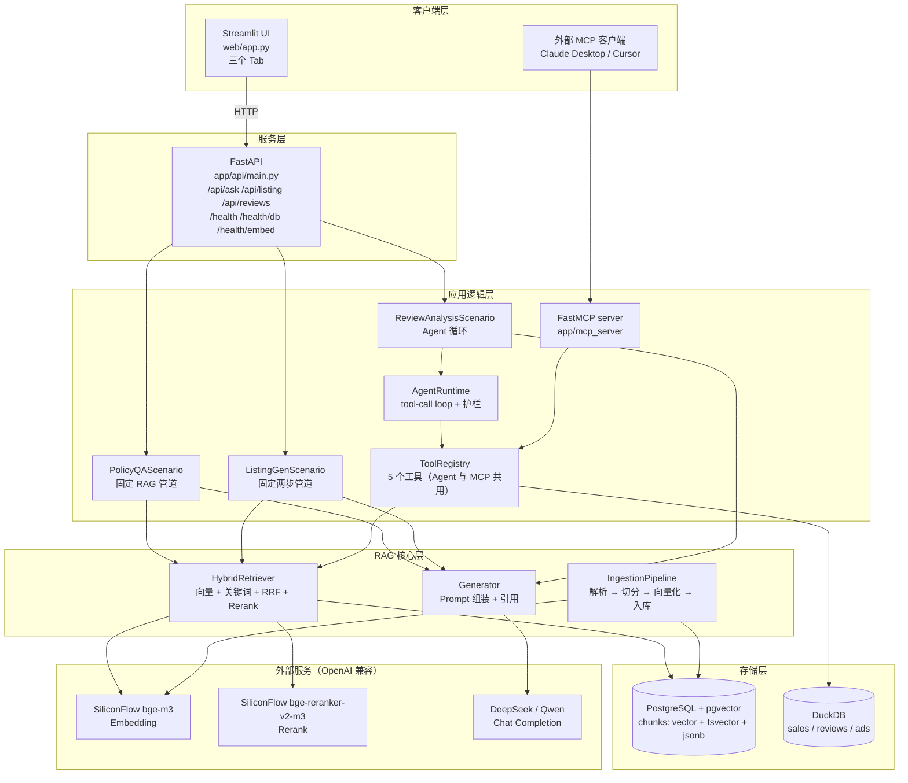
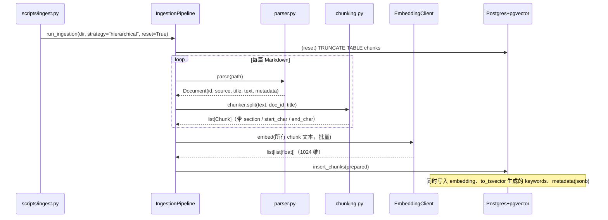
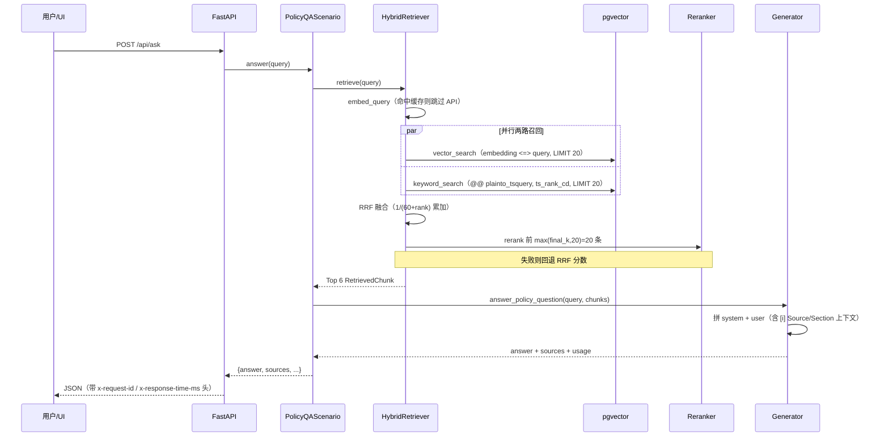
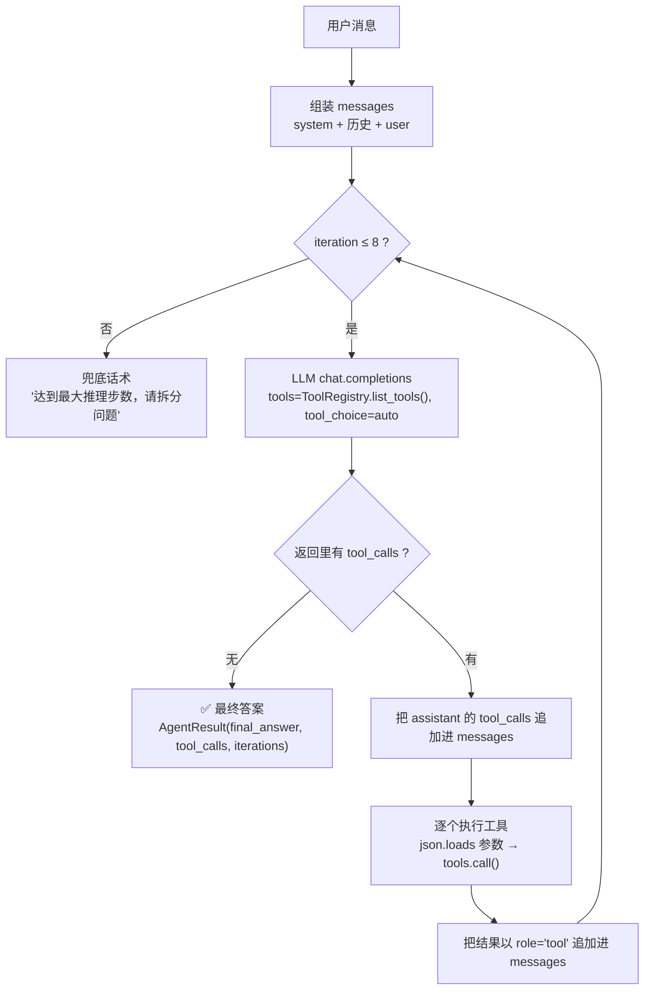
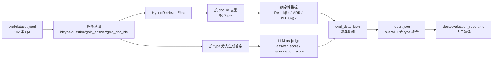

# PawPilot 概念解析与面试问答手册

> 本文档面向两类读者：
> 1. **初学者** —— 想搞懂这个项目里出现的每一个名词、每一步为什么要这么做。
> 2. **面试准备者** —— 需要能用工程师的语言，把项目讲清楚、讲深、经得起追问。
>
> 阅读建议：第一部分先建立全局认知，第二部分扫清概念盲区，第三、四部分理解架构与流程，
> 第八部分的面试问答是核心，可以反复演练。

---

## 目录

- [第一部分 · 项目速览](#第一部分--项目速览)
- [第二部分 · 基础概念扫盲](#第二部分--基础概念扫盲)
- [第三部分 · 系统架构](#第三部分--系统架构)
- [第四部分 · 四条核心流程](#第四部分--四条核心流程)
- [第五部分 · 关键设计决策与权衡](#第五部分--关键设计决策与权衡)
- [第六部分 · 工程化：稳定性 / 兼容性 / 性能](#第六部分--工程化稳定性--兼容性--性能)
- [第七部分 · 实测数据与 Badcase 分析](#第七部分--实测数据与-badcase-分析)
- [第八部分 · 面试问答（核心）](#第八部分--面试问答核心)
- [第九部分 · 诚实自评：亮点与不足](#第九部分--诚实自评亮点与不足)
- [第十部分 · 术语速查表](#第十部分--术语速查表)

---

## 第一部分 · 项目速览

### 1.1 一句话定位

**PawPilot 是一个面向 Amazon 美国站「宠物用品」跨境卖家的运营 Copilot**：
它把 Amazon 官方政策文档 + 公司内部 SOP 做成可检索的知识库（RAG），
再包一层能调用工具的 Agent，帮运营人员解决三类真实高频问题。

### 1.2 三个业务场景（这也是产品的三条主线）

| 场景 | 运营的真实痛点 | PawPilot 做什么 |
|---|---|---|
| **政策问答**（Policy Q&A） | "标题到底最多多少字符？"、"哪些词不能写？" 官方文档又长又散，人肉翻找效率极低 | 自然语言提问 → 检索相关条款 → 生成带**出处引用**的答案 |
| **Listing 生成与合规**（Listing Generator） | 写好文案后经常因违规词/夸大宣称被下架，人工校对不可靠 | 输入产品事实 → 生成英文 Listing → 自动跑一遍合规检查并指出问题词与改写建议 |
| **评论分析**（Review Analysis） | 几百条评论看不过来，看不出问题集中在哪，也不知道怎么改 | 按 SKU 聚合评论 → 归纳主题与情绪 → 输出可执行改进项 |

### 1.3 技术栈一览

| 层次 | 选型 | 一句话理由 |
|---|---|---|
| Web 框架 | FastAPI | 原生 async、自动生成 OpenAPI 文档、Pydantic 校验 |
| 前端 | Streamlit | 用 Python 快速做多 Tab 演示界面，不消耗前端工时 |
| 向量库 + 关系库 | PostgreSQL 16 + pgvector | **一个组件同时提供**向量检索、全文检索、元数据存储 |
| 向量化 / 重排 | SiliconFlow 的 `BAAI/bge-m3` + `BAAI/bge-reranker-v2-m3` | OpenAI 兼容协议，免费额度足够跑完整评测 |
| 生成模型 | DeepSeek（官方或 SiliconFlow 托管镜像）/ Qwen（DashScope） | 双 provider，演示供应商可替换性 |
| Agent | **自研** runtime（不依赖 LangChain） | 面试要证明"我能从零写出 Agent 循环和护栏" |
| 工具协议 | FastMCP | 同一套工具既能内部调用，也能被 Claude Desktop 等外部客户端调用 |
| 数据 | DuckDB + 模拟 CSV | 演示运营数据分析链路，不引入真实业务数据 |
| 工程化 | uv / ruff / mypy / pytest / GitHub Actions / Docker Compose | 体现可交付、可复现 |

### 1.4 一句话架构

> 用户 → Streamlit →（HTTP）→ FastAPI → 场景编排（固定管道 或 Agent 循环）
> → **混合检索**（pgvector 向量 + Postgres 全文 + RRF 融合 + Rerank）
> → LLM 生成（带引用）→ 返回结构化结果。

---

## 第二部分 · 基础概念扫盲

> 每小节统一结构：**是什么 → 为什么需要 → 本项目怎么落地 → 常见误解**。

### 2.1 RAG（Retrieval-Augmented Generation，检索增强生成）

**是什么**
先"查资料"再"写答案"。模型回答问题前，系统先从知识库里检索出最相关的若干段文字，
把它们塞进 Prompt 的上下文，再让大模型基于这些材料作答。

**为什么需要**

大模型有三个先天缺陷，RAG 正好补上：

| 缺陷 | 表现 | RAG 如何解决 |
|---|---|---|
| 知识过时 / 缺失 | 不知道你公司 2026 年的新 SOP | 知识放在外部库里，随时可更新，不用重训模型 |
| 幻觉 | 一本正经地编造政策条款和数字 | 要求"仅依据给定材料作答"，并给出引用可供人工核验 |
| 不可溯源 | 你不知道它为什么这么说 | 每个结论都能追到具体文档和章节 |

**和微调（Fine-tuning）的区别** —— 这是高频面试题，务必分清：

| 维度 | RAG | 微调 |
|---|---|---|
| 解决什么 | 模型**不知道**的事实性知识 | 模型**不会做**的格式/风格/任务 |
| 更新成本 | 重新灌库即可，分钟级 | 要重训，成本高、周期长 |
| 可解释性 | 强（有引用） | 弱（知识烧进了权重） |
| 幻觉 | 可缓解（有上下文约束） | 不一定改善，甚至可能加剧 |

一句话总结：**RAG 管"事实"，微调管"行为"**。本项目全部用 RAG，没有微调。

**本项目落地**
`app/rag/` 目录就是 RAG 的三段式：

```
app/rag/ingestion/    ← 离线：把文档切块、向量化、入库
app/rag/retrieval/    ← 在线：混合检索 + 重排
app/rag/generation/   ← 在线：把检索结果拼进 Prompt 生成答案
```

**常见误解**
- ❌ "RAG 就是不训练模型。" —— 不准确。有些方案会用 RAG 数据做微调，叫 RAFT；本项目的选择是纯检索增强。
- ❌ "上了 RAG 就没有幻觉了。" —— 错。检索不到、或模型不听话时照样幻觉。本项目的实测幻觉率是 **0.176**（越低越好），并不为零。

---

### 2.2 Embedding（向量化 / 嵌入）

**是什么**
把一段文字映射成一串固定长度的浮点数（向量）。语义相近的文字，向量在空间里的方向也相近。

**为什么需要**
计算机不能直接算"两句话意思像不像"。变成向量之后，就能用**余弦相似度**等数学手段衡量语义距离。
关键词检索只能匹配字面，向量检索能匹配**语义**（"dog leash" 能召回 "pet tether"）。

**本项目落地**
- 模型：`BAAI/bge-m3`，输出 **1024 维**（`embedding_dim=1024`）。
- 客户端：[embeddings.py](file:///Users/peter/py/RAG_AGENT/app/rag/ingestion/embeddings.py) 的 `EmbeddingClient`，走 OpenAI 兼容的 `embeddings.create` 接口。
- 存储：pgvector 的 `VECTOR(1024)` 列。
- 相似度：pgvector 的余弦距离算子 `<=>`（值越小越相似）。
- 性能优化：查询向量做了按 `(model, text)` 的有界缓存，重复问题不重复调用 API。

**常见误解**
- ❌ "向量维度越高越好。" —— 维度高表达力强，但存储和检索成本上升，且不一定带来收益。1024 是 bge-m3 的固有输出，不是我们调出来的。
- ❌ "Embedding 模型和生成模型是一回事。" —— 完全不同的两类模型。bge-m3 只会输出向量，不会说话。

---

### 2.3 Chunking（文本切分）

**是什么**
把整篇文档切成一段段长度合适的"块"（chunk），每块单独向量化、单独入库。

**为什么需要**
1. **模型上下文有限**：不可能把整本政策文档塞进 Prompt。
2. **检索精度**：块太大，检索命中的块里大部分内容与问题无关，会稀释信号、拉高 token 成本；
   块太小，语义被切断，检索不到或答案不完整。

**本项目的三种策略**（[chunking.py](file:///Users/peter/py/RAG_AGENT/app/rag/ingestion/chunking.py)）

| 策略 | 做法 | section 命名 | 适合 |
|---|---|---|---|
| `fixed` | 固定窗口滑动，步长 = `size - overlap` = 512 − 64 = 448 | `fixed_chunk_1` | 无结构的纯文本 |
| `recursive` | 先按空行切段落；段落超长再按句子边界（`[.!?。！？]`）递归拆 | `para_3_sub_2` | 段落结构清晰的长文 |
| `hierarchical` | 按 Markdown 标题（`#{1,3}`）切 section；超长 section 再交给 fixed 细分；无标题时降级为 fixed | `Title Requirements#1` | **有标题层级的文档（本项目默认）** |

**为什么默认用 `hierarchical`**
知识库是人工整理的 Markdown，有清晰的标题层级。按标题切分能：
- 保留**语义完整性**（一个条款不会从中间被劈开）；
- 天然携带**章节名**作为元数据，答案引用时可以说"出自 Title Requirements 这一节"，可解释性更强。

**Overlap（重叠）为什么要有**
相邻块共享 64 个字符。如果一句话正好被切在边界上，没有重叠两边都读不全；有重叠则至少有一块包含完整句子。

**常见误解**
- ❌ "chunk 越大越好，信息更全。" —— 会稀释检索信号并推高成本，本项目实测 512 是收益/成本较好的点。
- ❌ "切分是纯工程问题，不用管。" —— 恰恰相反，切分策略是 RAG 里影响召回质量最大的变量之一，本项目专门做了三组对比实验。

---

### 2.4 向量数据库与 pgvector

**是什么**
pgvector 是 PostgreSQL 的一个扩展，让 Postgres 多了一种 `VECTOR` 类型和向量检索能力。
"向量数据库"则是专门做向量索引与近邻搜索的系统（Milvus、Qdrant、Weaviate 等）。

**为什么本项目选 pgvector 而不是 Milvus**（详见 [ADR-001](file:///Users/peter/py/RAG_AGENT/docs/adr/001-why-pgvector-not-milvus.md)）

核心原因：**本项目是单机部署的演示/作品集项目，不是亿级向量的生产集群。**

| 维度 | pgvector | Milvus |
|---|---|---|
| 部署复杂度 | 一个 Postgres 容器 | 需要独立集群（etcd + MinIO + 多组件） |
| 事务 / 一致性 | ✅ 与业务数据同一个事务 | 通常是最终一致 |
| 混合检索 | ✅ 向量 + SQL 全文 + JSONB 元数据**一条 SQL 搞定** | 需要额外组件拼装 |
| 规模上限 | 百万~千万级较舒适 | 十亿级 |

本项目的检索语句可以在**同一个数据库、同一次查询**里完成"向量 + 关键词 + 元数据过滤"，这是 pgvector 最大的工程优势。

**本项目落地**（[store.py](file:///Users/peter/py/RAG_AGENT/app/rag/ingestion/store.py)）

`chunks` 表结构：

| 列 | 类型 | 用途 |
|---|---|---|
| `id` | BIGSERIAL | 主键 |
| `doc_id` | TEXT | 来源文档标识，用于引用溯源与评测 |
| `title` / `section` | TEXT | 标题与章节，用于引用展示 |
| `text` | TEXT | 块正文 |
| `strategy` | TEXT | 用了哪种切分策略（支持实验对比） |
| `start_char` / `end_char` | INTEGER | 原文位置，便于回溯 |
| `embedding` | `VECTOR(1024)` | 语义向量 |
| `keywords` | TSVECTOR | 全文检索列 |
| `metadata` | JSONB | 扩展元数据（用 `Jsonb(...)` 包装写入） |

**常见误解**
- ❌ "向量库必须专用。" —— 中小规模下 pgvector 完全够用，还省掉一整套运维。
- ❌ "向量检索能替代关键词检索。" —— 不能，见 2.7。

---

### 2.5 向量索引：ivfflat 与 HNSW

**是什么**
如果不建索引，pgvector 计算"查询向量与全表每一行的距离"（精确但全表扫描）。
近似最近邻（ANN）索引用一点精度换大幅提速。

**两种主流索引**

| 索引 | 原理 | 特点 |
|---|---|---|
| **IVFFlat** | 把向量聚成 `lists` 个簇；查询时只扫描最像的若干簇 | 建索引快、内存省；**数据量大时召回会下降**；需要先有数据再建 |
| **HNSW** | 多层图结构，逐层跳跃逼近 | 召回率高、查询快；建索引慢、内存占用大 |

**本项目落地**
建的是 **ivfflat，`lists = 100`**，距离算子 `vector_cosine_ops`（余弦）：

```sql
CREATE INDEX IF NOT EXISTS idx_chunks_embedding
ON chunks USING ivfflat (embedding vector_cosine_ops)
WITH (lists = 100);
```

`lists` 的经验取值约为 `sqrt(行数)`。当前语料只有 **135 个 chunk**，远小于索引的适用规模——
也就是说，**在这个数据量下索引几乎不改变结果，检索走的是"小表全扫"级别的成本**。
选 ivfflat 是为了把生产形态的表结构一次性搭好，而不是因为现在需要它。

**追问点（面试官很可能问）**
- "数据涨到 1000 万怎么办？" → 换 HNSW，或调大 `lists` 并按数据分片；同时把关键词检索与向量检索拆到读副本。
- "为什么要显式写 `::vector`？" → psycopg 不默认认识 vector 类型，本项目的做法是把 Python list 转成字符串再强转：`%s::vector`。

---

### 2.6 关键词检索：tsvector 与 GIN 索引

**是什么**
Postgres 内置的全文检索。`to_tsvector('english', text)` 把文本转成"词位 + 位置"的倒排结构（tsvector），
`plainto_tsquery('english', 'query')` 把查询转成查询式，二者用 `@@` 匹配。

**为什么在有向量检索之后还要关键词检索**

两者是**互补**关系，不是替代：

| 场景 | 向量检索 | 关键词检索 |
|---|---|---|
| "dog leash" vs "pet tether"（同义不同词） | ✅ 能召回 | ❌ 召回不到 |
| 精确编号 / 专有名词（`B0XXXXX`、`ACOS`、`FBA`） | ⚠️ 可能被语义"抹平" | ✅ 精准命中 |
| 生僻缩写、违规词字面匹配 | ⚠️ 不稳定 | ✅ 稳定 |

合规检查这类任务**必须**做到字面精确（"cure" 就是 "cure"，不能因为语义相近被放过），所以关键词通道不可少。

**本项目落地**
- 写入时：`to_tsvector('english', text)` 写入 `keywords` 列。
- 查询时：`keywords @@ plainto_tsquery('english', %s)`，按 `ts_rank_cd` 排序取 Top-K。
- 索引：`GIN(keywords)`，GIN 是倒排索引，适合这种"包含"型查询。
- 降级：关键词检索抛异常时自动回退到纯向量检索（反之亦然），只降质量不报错。

---

### 2.7 混合检索（Hybrid Search）与 RRF

**是什么**
把向量检索和关键词检索的结果**融合**成一个排名。最常用的融合算法是 **RRF（Reciprocal Rank Fusion，倒数排名融合）**。

**RRF 公式**

对每个文档 $d$：

$$\text{score}(d) = \sum_{r \in \text{rankers}} \frac{1}{k + \text{rank}_r(d)}$$

其中 `rank_r(d)` 是 $d$ 在第 $r$ 路检索里的名次（从 1 开始），$k$ 是平滑常数。

**本项目取值：`rrf_k = 60`**（业界常用默认值），代码：

```python
scores[chunk.id] = scores.get(chunk.id, 0.0) + 1.0 / (rrf_const + rank)
```

**为什么用 RRF 而不是"加权求和原始分数"**
- 向量分数（余弦距离）和关键词分数（`ts_rank_cd`）**量纲完全不同**，直接加权需要先归一化，而归一化本身不稳定。
- RRF **只用名次，不用分数**，天然免归一化，对两路分数的尺度差异免疫。
- 一个文档只要在任一路里排名靠前，就能获得高分——这正是"融合"想要的效果。

**举例（`k=60`）**

| 文档 | 向量名次 | 关键词名次 | RRF 分数 |
|---|---|---|---|
| A | 1 | 未召回 | 1/61 ≈ 0.0164 |
| B | 3 | 2 | 1/63 + 1/62 ≈ 0.0320 |
| C | 10 | 1 | 1/70 + 1/61 ≈ 0.0307 |

B 因为"两路都不差"而排在第一——这就是 RRF 的直觉。

**本项目落地**：[hybrid.py](file:///Users/peter/py/RAG_AGENT/app/rag/retrieval/hybrid.py) 的 `HybridRetriever.retrieve()`
先各取 `retrieval_top_k = 20` 条，RRF 融合后按分数降序，再进入重排环节。

---

### 2.8 Rerank（重排序）

**是什么**
用**交叉编码器（Cross-Encoder）**对"查询 + 候选文档"逐对打分，重新排序。

**和向量检索的本质区别 —— 这是面试必考**

| | 向量检索（Bi-Encoder） | Rerank（Cross-Encoder） |
|---|---|---|
| 计算方式 | 查询和文档**各自独立**编码成向量，再算相似度 | 查询和文档**拼在一起**送进模型，直接输出相关度 |
| 能否预计算 | ✅ 文档向量离线算好 | ❌ 必须在线逐对计算 |
| 精度 | 较低 | **明显更高** |
| 延迟 | 低（可索引加速） | 高（O(候选数) 次模型前向） |
| 在系统里的位置 | **召回**（从全库到几十条） | **精排**（从几十条到最终几条） |

一句话：**因为贵，所以只用在最后一小批候选上。**

**本项目落地**
- 模型：`BAAI/bge-reranker-v2-m3`（SiliconFlow，`/rerank` 接口）。
- 候选数：`rerank_candidates = fused[:max(final_k, 20)]` —— 取 `max(6, 20) = 20` 条进入重排。
  这个 `max()` 的意义是：**即使把最终条数调小，也要保证重排有足够的候选池**，否则重排没得挑。
- 排序：最终按 `rerank_score` 排；若重排失败则回退用 `rrf_score` 排。
- 降级：`except Exception` 捕获后直接用 RRF 分数，**保证检索链路不因重排服务抖动而整体失败**。

**常见误解**
- ❌ "Rerank 是可有可无的锦上添花。" —— 在 RAG 里它的性价比往往高于换更大的生成模型，因为"喂对材料"比"模型更聪明"更能提升答案质量。

---

### 2.9 Agent 与 Tool Calling（工具调用）

**是什么**
Agent = **LLM + 工具 + 循环**。模型不仅能生成文字，还能"决定调用某个函数、拿到返回值、再继续思考"，
直到它认为可以给出最终答案为止。

**一次工具调用的完整回合**

```
① 用户提问
② LLM 返回 tool_calls（要调 search_policies，参数 {"query": "..."}）
③ 系统真的去执行这个函数，拿到结果
④ 把结果以 role="tool" 追加回对话历史
⑤ 再次请求 LLM → 它可能再调工具，也可能给出最终答案
⑥ 直到没有 tool_calls 或达到最大轮数 → 结束
```

**本项目自研 runtime 的关键设计**（[runtime.py](file:///Users/peter/py/RAG_AGENT/app/agent/runtime.py)）

| 机制 | 实现 |
|---|---|
| 循环 | `for iteration in range(1, max_iterations + 1)`，`max_iterations = 8` |
| 终止条件 | 模型返回的消息里**没有 tool_calls** → 视为最终答案 |
| 工具分发 | `await self.tools.call(name, arguments)`，参数是 JSON 字符串，`json.loads` 后解包 |
| 记忆 | 把 assistant 的 `tool_calls` 和对应的 `role="tool"` 结果都 append 进 `messages`，形成完整上下文 |
| 护栏 | 达到上限仍无终答 → 返回**友好的兜底话术**，而不是抛异常或死循环 |
| 参数容错 | `json.loads` 失败时退化为空 dict，避免整轮崩溃 |
| 采样参数 | `temperature=0.3`（运营场景要稳定、少发挥） |
| 返回值 | `AgentResult(final_answer, tool_calls, iterations, provider, model)` |

**为什么不用 LangChain / LlamaIndex**（[ADR-002](file:///Users/peter/py/RAG_AGENT/docs/adr/002-why-self-built-agent-runtime.md)）

1. **能力证明**：FDE / LLM 工程岗的核心考察点之一就是"你到底懂不懂 Agent 循环里发生了什么"。
   用框架能跑通，但说不清"工具结果怎么回填、护栏加在哪、记忆怎么截断"——面试会立刻暴露。
2. **可控性**：自研 runtime 只有约 150 行，超时、轮数上限、错误处理都看得见、改得动。
3. **依赖面小**：框架版本迭代快、抽象层厚，出问题时排查成本高。

**代价（要主动承认）**
- 没有多 Agent 编排、没有内建记忆压缩、没有复杂的中断恢复；
- 真要上生产复杂场景，仍会考虑用框架补齐这些能力。

---

### 2.10 MCP（Model Context Protocol）

**是什么**
Anthropic 提出的开放协议，用统一的方式把"工具/数据源"暴露给任意 MCP 客户端（Claude Desktop、Cursor、IDE 等）。
可以理解为 **"AI 世界的 USB-C 接口"**：工具方实现一次，所有支持 MCP 的客户端都能用。

**它解决什么问题**
在 MCP 之前，每个 AI 应用都要为每个工具写一套适配代码（M×N 问题）。
有了 MCP，工具方按协议实现一次，客户端按协议对接一次（M+N 问题）。

**本项目落地**（[server.py](file:///Users/peter/py/RAG_AGENT/app/mcp_server/server.py)）
- 用 **FastMCP** 起名为 `pawpilot` 的 server，**stdio** 传输。
- **关键设计：MCP server 与内部 Agent 共用同一个 `ToolRegistry`**。
  也就是说 [tools.py](file:///Users/peter/py/RAG_AGENT/app/agent/tools.py) 里的 5 个 handler，既是 Agent 的工具，也是 MCP 的工具——
  **一份实现，两处暴露**，不存在"内部能用、外部不能用"或两份逻辑漂移的问题。
- 启动：`uv run python -m app.mcp_server.server`；Claude Desktop 通过 `claude_desktop_config.json` 指向它。

**5 个工具**

| 工具 | 参数 | 作用 |
|---|---|---|
| `search_policies` | `query` | 混合检索政策/SOP 文档 |
| `check_listing_compliance` | `draft_text` | 检索规则后做合规检查 |
| `query_sales_data` | `sql` | DuckDB SQL 查销售/评论/广告表 |
| `analyze_reviews` | `sku`, `days=90` | 聚合评论主题 + 生成分析 |
| `get_product_info` | `sku` | 取商品规格相关片段 |

**常见误解**
- ❌ "MCP 是模型的东西。" —— 不是，是对接协议，跟具体模型无关。
- ❌ "用了 MCP 就不用 Agent 了。" —— 两者正交：MCP 管"工具怎么对外暴露"，Agent 管"模型怎么决定用工具"。

---

### 2.11 LLM-as-a-Judge（用大模型当裁判）

**是什么**
让一个 LLM 按评分标准给另一个 LLM 的输出打分。因为很多质量维度（答案是否切题、是否有幻觉）
没有标准答案，无法用字符串匹配衡量。

**本项目落地**（[runner.py](file:///Users/peter/py/RAG_AGENT/eval/runner.py)）
裁判模型被要求输出两个 0~1 的分数：
- `answer_score`：答案相对标准答案的**正确性/完整性**。
- `hallucination_score`：**幻觉程度，越低越好**。

**为什么要坦白它的局限**
- 分数**不可复现**：同一份输出，两次评分可能不同。
- 有**位置偏好、长度偏好**等已知偏差。

因此本项目在 [评测报告](file:///Users/peter/py/RAG_AGENT/docs/evaluation_report.md) 里明确写了：
**绝对值仅供参考，应该用于"不同配置之间的横向对比"**（比如开/关 rerank），而不是当成绝对真值。

---

### 2.12 检索评测指标：Recall@k / MRR / nDCG@k

**为什么要有确定性指标**
LLM 评分有噪声，而"检索对不对"是可以精确计算的——只要我们知道每个问题的**标准答案文档**（`gold_doc_ids`）。
这让我们可以脱离 LLM、快速、可复现地迭代检索策略。

**定义（[metrics.py](file:///Users/peter/py/RAG_AGENT/eval/metrics.py) 的实际实现）**

**Recall@k（召回率）** —— 该找的文档，找到了几成？

$$\text{Recall@}k = \frac{|\text{gold} \cap \text{retrieved}_{:k}|}{|\text{gold}|}$$

```python
hits = len(set(gold) & set(retrieved_k))
return hits / len(gold)
```

**MRR（平均倒数排名）** —— 第一个正确答案排在第几？排得越前分越高。

$$\text{MRR} = \frac{1}{|\mathcal{Q}|}\sum_{q}\frac{1}{\text{rank}_q^{\text{first hit}}}$$

```python
for rank, doc_id in enumerate(retrieved, start=1):
    if doc_id in gold:
        return 1.0 / rank
return 0.0
```

**nDCG@k（归一化折损累计增益）** —— 不仅看找没找到，还看**排得好不好**。

$$\text{DCG@}k = \sum_{i=1}^{k}\frac{\text{rel}_i}{\log_2(i+1)}, \qquad \text{nDCG@}k = \frac{\text{DCG@}k}{\text{IDCG@}k}$$

本项目用的是**二元相关性**（命中记 1，未命中记 0），IDCG 取理想排序：

```python
dcg += 1.0 / math.log2(rank + 1)          # 命中才加分
ideal_hits = min(len(gold), k)
idcg = sum(1.0 / math.log2(i + 1) for i in range(1, ideal_hits + 1))
return dcg / idcg if idcg else 0.0
```

**三个指标怎么配合看**

| 指标 | 关注点 | 回答的问题 |
|---|---|---|
| Recall@k | **覆盖度** | 材料够不够？ |
| MRR | **首位命中** | 最好的那条排第一了吗？ |
| nDCG@k | **整体排序质量** | 好材料都排在前面吗？ |

**常见误解**
- ❌ "nDCG 一定要用分级相关性。" —— 本项目是二元版本（命中/未命中），实现简单且在只有单一 `gold_doc_ids` 标注时更稳妥。分级 nDCG 需要标注"部分相关"，成本高。
- ❌ "Recall 高就说明检索好。" —— 只看 Recall 会忽略排序；三者要一起看。

---

### 2.13 幻觉（Hallucination）

**是什么**
模型生成了听起来合理、但**没有依据**的内容——编造条款编号、编造数字、编造来源。

**本项目的三重抑制**
1. **Prompt 层**：system 明确要求"仅依据提供的知识库片段作答"，并要求"若上下文没有就直说，不要编造政策、数字或 URL"。
2. **结构层**：强制引用格式 `[source: doc_id, section]`，让每一条事实都能被人工回查。
3. **度量层**：评测里专设 `hallucination_score`，把幻觉变成**可观测、可跟踪**的指标，而不是感觉。

**实测结果**
整体幻觉分 **0.176**，其中：
- 政策问答 **0.148**（最好，因为知识库是精心整理的英文政策文档）
- 评论分析 **0.360**（最差，原因见第七部分）

---

## 第三部分 · 系统架构

### 3.1 分层架构



### 3.2 目录结构与职责映射

| 路径 | 职责 | 关键文件 |
|---|---|---|
| `app/core/` | 配置与 LLM 客户端工厂 | `config.py`（Settings 单一事实源）、`llm.py` |
| `app/rag/ingestion/` | **离线**管道：解析、切分、向量化、入库 | `parser.py` `chunking.py` `embeddings.py` `store.py` `pipeline.py` |
| `app/rag/retrieval/` | **在线**混合检索 | `hybrid.py` |
| `app/rag/generation/` | Prompt 模板与生成 | `prompts.py` `generator.py` |
| `app/agent/` | 自研 Agent runtime 与工具注册表 | `runtime.py` `tools.py` |
| `app/scenarios/` | 三个业务场景编排 | `policy_qa.py` `listing_gen.py` `review_analysis.py` |
| `app/mcp_server/` | FastMCP 服务端 | `server.py` |
| `app/data/` | 模拟业务数据与 DuckDB 查询 | `simulated.py` |
| `app/api/` | FastAPI 入口、中间件、护栏 | `main.py` |
| `web/` | Streamlit 三 Tab UI | `app.py` |
| `eval/` | 评测集生成、runner、指标 | `generate_qa.py` `runner.py` `metrics.py` `dataset.jsonl` |
| `scripts/` | 运维脚本 | `ingest.py` |
| `docker/` | Compose 编排 | `docker-compose.yml`（dev db）、`docker-compose.full.yml`（全栈） |
| `docs/` | 部署、运维、评测报告、ADR | 见目录 |

**一句话读法**：
`ingestion` 是**离线**的（跑一次，灌库），`retrieval` + `generation` 是**在线**的（每次请求都跑）。
把这条线记住，架构就清楚了一半。

---

## 第四部分 · 四条核心流程

### 4.1 离线灌库流程（Ingestion）

**什么时候跑**：知识库变更时手动执行 `uv run python scripts/ingest.py --reset`。**不在请求路径上**。



**关键点**
- `doc_id` 由**相对路径**生成 → 稳定、可复现，是评测里 `gold_doc_ids` 的锚点。
- 写入时**一次性**生成三样东西：向量（用于语义）、tsvector（用于关键词）、JSONB（用于过滤）。
- 当前规模：**14 篇文档 → 135 个 chunk**。

---

### 4.2 在线问答流程（RAG）

**触发**：`POST /api/ask {"query": "..."}` → `PolicyQAScenario.answer()`。



**为什么问答场景用"固定管道"而不是 Agent 循环**
问答的步骤是**确定的**：检索 → 生成。用 Agent 只会带来额外的 LLM 往返（每轮都要模型决策）、
更高的延迟和不确定的 token 成本，收益几乎为零。
**能确定的事就不要交给模型去决定** —— 这是本项目的核心工程判断之一。

---

### 4.3 Agent 工具循环流程

**触发**：`ReviewAnalysisScenario`（以及任何需要多步推理、按需查数据的任务）。



**关键设计点**
1. **终止靠"没有 tool_calls"**，而不是靠模型说"我完成了"——更可靠，因为工具调用是结构化的。
2. **结果以 `role="tool"` 回填**，并携带 `tool_call_id`。这不是可选的美化，而是 OpenAI 协议的要求：
   模型需要靠 id 把"我请求的工具"和"返回的结果"对应起来。
3. **护栏在循环外**：`max_iterations=8` 是硬上限，超了返回友好话术，绝不无限循环。
4. **单步工具超时 60s**（`tool_timeout_seconds`），防止某个工具卡死拖垮整个请求。
5. **参数解析容错**：模型偶尔会返回非法 JSON，此时退化为 `{}` 而不是抛异常。

---

### 4.4 评测流程

**触发**：`uv run python eval/runner.py`。



**为什么检索指标要"去重后再算"**
一个文档可能有多个 chunk 被召回。如果不按 `doc_id` 去重，
一条问题召回同文档 3 个 chunk 会让"命中数"虚高；去重后指标才反映真实的**文档级**召回能力。

**数据集构成**：`type` 分三类 —— `policy_qa` / `listing_compliance` / `review_analysis`，
每条含 `id`、`type`、`question`、`gold_answer`、`gold_doc_ids`。

---

## 第五部分 · 关键设计决策与权衡

> 面试官最爱问的其实是"**你为什么这么选**"。以下每条都准备一个"决策 / 备选 / 理由 / 代价"四段式。

### 5.1 为什么 pgvector 而不是 Milvus（[ADR-001](file:///Users/peter/py/RAG_AGENT/docs/adr/001-why-pgvector-not-milvus.md)）

- **决策**：用 PostgreSQL + pgvector，一个容器搞定向量 + 全文 + 元数据。
- **备选**：Milvus / Qdrant / Weaviate。
- **理由**：本项目是单机作品集项目（135 chunk），不需要十亿级集群；
  更重要的是**混合检索可以在一条 SQL / 一个事务里完成**，部署与运维成本极低。
- **代价**：规模上限低。上亿向量需要换专业向量库并做分片。

### 5.2 为什么自研 Agent runtime 而不是直接用 LangChain（[ADR-002](file:///Users/peter/py/RAG_AGENT/docs/adr/002-why-self-built-agent-runtime.md)）

- **决策**：手写 tool-call 循环、记忆回填、轮数护栏。
- **理由**：① 面试要能讲清循环内部机制；② 约 150 行，完全可控可改；③ 依赖面小。
- **代价**：没有多 Agent 编排、记忆压缩等高级能力，复杂场景仍需框架补齐。

### 5.3 为什么 DeepSeek + Qwen 双 provider（[ADR-003](file:///Users/peter/py/RAG_AGENT/docs/adr/003-why-deepseek-plus-qwen.md)）

- **决策**：所有模型调用统一走 **OpenAI 兼容协议**，通过 `default_provider` 切换。
- **理由**：证明**供应商可替换性**与风险意识 —— 单一模型商涨价、限流、下线时能快速切换，成本可控。
- **代价**：需要维护多套 key 与 base_url 配置。

### 5.4 为什么加 provider 自动降级（本项目的实战补丁）

**背景**：DeepSeek 官方 key 在这个环境里全部返回 401。
**做法**：[config.py](file:///Users/peter/py/RAG_AGENT/app/core/config.py#L107-L133) 的 `resolve_generation_provider()`
在"没有原生 DeepSeek key、但有 SiliconFlow key"时，**透明地**改用 SiliconFlow 托管的 `deepseek-ai/DeepSeek-V3`。

**意义（面试可讲成亮点）**：这是一个真实的**供应商风险应对**案例——
一个 key 就能同时提供 embedding + rerank + 生成，系统仍然跑通，且调用方代码零改动。
这正是"兼容性优先"原则的兑现。

### 5.5 为什么 Listing 场景从"开放式 Agent"改成"固定两步管道"

- **原来**：交给 Agent 自由决定检索什么、调用什么工具。
- **问题**：延迟不可预测（模型可能多轮往返），演示和压测都不好把握。
- **改后**：固定为 `检索合规规则 → 生成 Listing → 合规检查`，延迟可预测、行为可复现。
- **总结成一句面试话术**："**能用确定性管道解决的事，不要交给概率模型去做决策。**"

### 5.6 为什么用 RRF 而不是加权分数融合

见 [2.7](#27-混合检索hybrid-search与-rrf)。核心：两路分数**量纲不同**，RRF 只用名次，免归一化、更稳健。

---

## 第六部分 · 工程化：稳定性 / 兼容性 / 性能

项目明确把这三条作为**设计原则**（见 [todolist.md](file:///Users/peter/py/RAG_AGENT/todolist.md) 第一节），并且逐条落地。

### 6.1 稳定性

| 机制 | 落地 |
|---|---|
| **数据库连接池** | `psycopg_pool.ConnectionPool`（min=1 / max=8 / timeout=30s），按 DSN 进程级复用、懒加载、`atexit` + FastAPI shutdown 优雅回收 |
| **HTTP 客户端复用** | `AsyncOpenAI` 按「事件循环 + provider」缓存，复用 httpx keep-alive 连接 |
| **超时与重试** | LLM：120s / 重试 3 次；Embedding & Rerank：60s / 重试 3 次；DB 获取连接：30s |
| **检索降级** | 向量检索失败 → 关键词兜底；关键词失败 → 向量兜底；Rerank 失败 → 回退 RRF 排序 |
| **Agent 护栏** | `max_iterations = 8`；单步工具超时 60s；非法 JSON 参数容错 |
| **输入护栏** | `query ≤ 2000` 字符；`product_info ≤ 50` 键、单值 `≤ 2000` 字符 |
| **健康检查** | `/health`、`/health/db`（返回 chunk 数）、`/health/embed`（不产生付费调用） |

### 6.2 兼容性

- **统一 OpenAI 兼容协议**：LLM / Embedding / Rerank 全部走标准接口，不绑定厂商 SDK 特性。
- **多 provider 切换**：`default_provider` 一行配置切换 deepseek / qwen；缺 key 时自动降级。
- **配置校验**：Pydantic Settings + `validate_runtime()`，启动即 fail fast 并给出明确错误。
- **Docker 命令兼容**：文档同时给出 `docker compose`（v2 插件）与 `docker-compose`（独立二进制）两种写法。

### 6.3 性能

| 优化 | 效果 |
|---|---|
| DB 连接池 | 去掉每次查询的 TCP + 鉴权握手；实测 **0.77ms/次**（`count_chunks`）、**1.0ms/次**（`keyword_search`） |
| HTTP 客户端复用 | 复用 keep-alive，避免每请求重建 httpx 连接池 |
| Embedding 查询缓存 | `(model, text)` 有界缓存（上限 512），重复问题省掉一次付费 embedding 调用 |
| pgvector ivfflat + GIN 索引 | 向量与全文检索都有索引可用 |
| 批处理 | 灌库与重排阶段的 embedding / rerank 均批量调用 |
| 延迟可观测 | 中间件为每个响应回写 `x-response-time-ms`，并写入日志 |

### 6.4 可观测性

- 每个请求生成 `request_id`，回写 `x-request-id` 响应头，并随日志输出（问题可归因到具体请求）。
- 结构化日志：`方法 / 路径 / 状态码 / 耗时`。
- 未做（诚实说明）：阶段级 latency 拆分（retrieve / generate）、`/metrics`、统一 token 成本统计。

---

## 第七部分 · 实测数据与 Badcase 分析

### 7.1 评测配置与总体结果

- 数据集：**102 条** QA（`policy_qa` / `listing_compliance` / `review_analysis`）
- 检索深度：**k = 6**
- 复现：`uv run python scripts/ingest.py --reset` → `uv run python eval/runner.py`
- 原始产物：`eval/reports/report.json`（聚合）、`eval/reports/eval_detail.jsonl`（逐条）

| 指标 | 值 |
|---|---|
| Recall@6 | **0.863** |
| MRR | **0.823** |
| nDCG@6 | **0.793** |
| Answer score | **0.875** |
| Hallucination score（越低越好） | **0.176** |

### 7.2 分场景结果

| 场景 | Recall@6 | MRR | nDCG@6 | Answer | Hallucination |
|---|---|---|---|---|---|
| Policy QA | 0.976 | 0.896 | 0.907 | 0.934 | 0.148 |
| Listing compliance | 0.700 | 0.567 | 0.559 | 0.920 | 0.080 |
| Review analysis | 0.675 | 0.854 | 0.675 | 0.645 | 0.360 |

### 7.3 归因：为什么是这三个数（面试重点，要讲出因果）

**Policy QA 最强（Recall 0.976）**
知识库主体是**结构清晰、术语规范的英文政策文档**，`hierarchical` 切分保留了标题与条款完整性，
问题与条款的措辞重合度高，所以向量与关键词两路都很准。属于"**数据友好型**"场景。

**Listing compliance 检索偏低（0.700）但答案分很高（0.920）**
归因到**评测标注口径**，而非系统能力：
一个合规问题往往同时对应**多篇**规则文档（如"禁用词"+"标题规范"都会回答到），
而 `gold_doc_ids` 只标了其中一篇 → 检索到另一篇等同主题文档时，**指标判为未命中**。
但生成端只要拿到"任意一边"的规则就足以给出正确答案，所以 `answer_score` 依然很高。
**结论：这类指标低估了系统的实际可用性。**

**Review analysis 最弱、幻觉最高（0.360）**
归因到**数据源本质**：该场景一半依赖 **DuckDB 里的模拟业务数据**（评论、销量、广告），
而不是文档索引。检索指标只能衡量"文档"那一半，因此 Recall 天然受限；
同时模型要基于结构化数据做归纳，一旦数据不足就容易"补空"，导致幻觉分升高。
**这是已知且有意的局限**（见 [evaluation_report.md](file:///Users/peter/py/RAG_AGENT/docs/evaluation_report.md)）。

### 7.4 已记录的方法论局限（主动坦白，反而加分）

1. `gold_doc_ids` 由人工标注，**部分问题本就可由多篇文档回答**，当前口径会低估召回。
2. 评论分析场景**混合了文档检索与结构化数据推理**，现有指标只覆盖前者。
3. LLM-as-judge 分数**不可复现**，应只用于**配置间横向对比**，不能当绝对真值。

---

## 第八部分 · 面试问答（核心）

> 每题结构：**问题 → 面试官在考察什么 → 回答（可直接说出口的版本） → 可能的追问与应对**。

### A. 项目概述类

#### A1. 用两分钟介绍一下这个项目

**考察**：能不能在有限时间里讲清"做了什么、为什么、结果如何"，而不是从头念技术栈。

**回答**：
> PawPilot 是面向 Amazon 美国站宠物用品卖家的运营 Copilot，解决三类高频问题：政策问答、Listing 生成与合规、评论分析。
>
> 技术上它是一个完整的 RAG + Agent 系统：知识库由 Amazon 政策文档和内部 SOP 构成，
> 走的是 `Markdown 解析 → 分层切分 → bge-m3 向量化 → pgvector 入库` 的离线管道；
> 在线检索是混合检索——pgvector 向量召回和 Postgres 全文召回并行，用 RRF 融合，再用 bge-reranker 精排到 Top 6。
> 在此之上有三种编排：政策问答用固定 RAG 管道，Listing 用固定的"生成 + 合规检查"两步管道，评论分析走自研 Agent 的工具循环。
> 所有工具通过一个共享的 ToolRegistry 同时暴露给 Agent 和 FastMCP server，外部 MCP 客户端可以直接调用。
>
> 我做了完整的评测：102 条 QA，检索指标 Recall@6 是 0.863、MRR 0.823、nDCG@6 0.793，
> LLM 裁判的答案分 0.875、幻觉分 0.176，并且按三个场景做了分组归因。
> 工程上配了 CI（ruff + mypy + pytest）和 Docker Compose 全栈，一条命令能起起来。

**追问：一句话说清它和"调个 API 套个壳"的区别？**
> 区别在于检索链路和评测。套壳项目没有混合检索、没有重排、没有降级策略，也没有办法回答"改了切分策略之后效果是变好还是变差"。
> 这个项目每一层都有可测量的指标支撑决策。

---

#### A2. 这个项目最难的三个点是什么？

**考察**：是否真的动手做过，而不是照着教程抄。

**回答**（三个点各有因果，不要泛泛而谈）：
> 第一，**检索质量的可控性**。策略组合很多——切分策略、是否开启关键词通道、是否做重排——如果没有确定性指标，每次改动都只能"感觉好像好点了"。
> 所以我先建了 102 条带 `gold_doc_ids` 的评测集，把 Recall / MRR / nDCG 做成纯函数指标，再去做对比，改动才有方向。
>
> 第二，**延迟的可预测性**。Listing 场景最初是开放式 Agent 循环，模型可能来回好几轮，P95 延迟没法预估。
> 我把它改成固定管道——检索规则 → 生成 → 合规检查，把"需要模型决策"的部分压到最少，延迟就稳定了。
>
> 第三，**真实环境下的供应商适配**。实际调试时 DeepSeek 官方 key 一直 401。
> 我没有硬编码绕过去，而是在配置解析层做了 provider 降级：没有原生 DeepSeek key 时自动走 SiliconFlow 托管的同款模型，
> 这样一份 API key 就能同时提供 embedding、rerank 和生成，调用方代码零改动。

---

#### A3. 为什么选这三个场景？

**回答**：
> 因为它们覆盖了 RAG 系统三种典型的负载形态：
> 政策问答是**纯文档 RAG**（检索质量决定一切）；
> Listing 生成是**生成 + 规则校验**（既要创作又要确定性检查，所以我用固定管道而不是 Agent）；
> 评论分析是**结构化数据分析 + Agent 编排**（需要按需查 DuckDB、多步推理）。
> 三种形态都覆盖到，才能在评测里暴露出不同的问题——后来的结果也证实了，三个场景的指标差异很大，归因路径完全不同。

---

### B. RAG 与检索类

#### B1. 为什么用 RAG 而不是微调？

**考察**：是否理解两者的边界（这是最高频的 RAG 问题）。

**回答**：
> 因为我要解决的是"模型**不知道**这些事实"的问题，而不是"模型**不会**做这个任务"的问题。
> Amazon 的政策条款、公司 SOP 是私有且会变化的——今天改了标题字符上限，明天加了一条禁用词。
> RAG 只要重新灌库，分钟级生效；微调要重训，成本高、周期长，而且更新一条事实就得再训一次。
> 另外这个场景对**可追溯性**要求很高：运营要能确认"你说的这条规定出自哪份文档哪一节"，
> RAG 天然带引用，微调是把知识烧进权重，给不出出处。
>
> 我的判断是：**RAG 管"事实"，微调管"行为/风格"**。这个项目没有需要改变模型行为的需求，所以全部用 RAG。
> 如果将来要做"固定话术风格的客服回复"，那时候微调才会进入选项。

**追问：RAG 有什么解决不了的问题？**
> 两类。一是**多跳推理**：答案分散在好几篇文档里、需要串起来推理的，单次检索够不着——要上多轮检索或查询改写。
> 二是**全局性问题**：比如"我们所有政策里一共有多少条禁用词"，这类需要遍历全库聚合的问题，Top-K 检索天然不合适，得走结构化查询或 Map-Reduce 式的分治。

---

#### B2. 你的检索链路是怎么设计的？

**回答**：
> 是"双路召回 + RRF 融合 + 交叉编码器精排"的三段式。
>
> **召回阶段**并行跑两路：向量路用 bge-m3 把查询编码成 1024 维向量，走 pgvector 的余弦距离 `<=>` 取 Top 20；
> 关键词路用 Postgres 的全文检索，`plainto_tsquery` 匹配 tsvector，按 `ts_rank_cd` 取 Top 20。
>
> **融合阶段**用 RRF，分数是 `Σ 1/(k + rank)`，我取 `k = 60`。
> 选 RRF 而不是加权求和，是因为两路分数一个是余弦距离、一个是全文相关度，量纲不同，直接加权要先归一化，而归一化本身不稳定；RRF 只用名次，天然免疫这个问题。
>
> **精排阶段**取融合后的前 20 条（代码是 `max(final_k, 20)`，保证即使把最终条数调小也有足够候选池）送进 bge-reranker-v2-m3 逐对打分，最后返回 Top 6 给生成层。
>
> 另外每一层都有降级：重排服务挂了就用 RRF 分数排；关键词检索异常就退回纯向量，反之亦然。**任何一路坏掉只降质量，不会让请求整体失败。**

**追问：为什么要两路？只用向量不行吗？**
> 不行，两者互补。向量强在语义——"dog leash" 能召回 "pet tether"；但它在**精确字面**上不稳，比如 ASIN、`ACOS`、`FBA` 这类缩写，或者合规检查要找的禁用词 "cure"。
> 合规这个场景恰恰要求字面精确，不能因为语义相近就放过。所以关键词通道是刚需，不是可选优化。

---

#### B3. RRF 为什么有效？`k` 取 60 是什么含义？

**回答**：
> RRF 的核心思想是**只用名次、不用分数**。公式是 `score(d) = Σ_r 1/(k + rank_r(d))`。
> 因为它丢掉了原始分数只保留名次，所以两路分数就算量纲差几个数量级也完全不影响融合结果，不需要任何归一化——这是它比加权求和更稳健的根本原因。
>
> `k` 是平滑常数，作用是**削弱"第一名"的绝对优势**。
> `k` 取 60 时，第 1 名贡献 1/61 ≈ 0.0164，第 10 名贡献 1/70 ≈ 0.0143，差距不大；
> 如果 `k` 取 0，第 1 名是 1.0、第 10 名是 0.1，差距 10 倍，第一名会垄断。
> 60 是业界常用的默认值，效果是**鼓励"多路都排名靠前"的文档胜出**，而不是让某一路的第一名直接定胜负。
>
> 举个我实际逻辑里的例子：文档 B 在向量路第 3、关键词路第 2，得分 1/63 + 1/62 ≈ 0.032；
> 文档 C 在向量路第 10、关键词路第 1，得分 1/70 + 1/61 ≈ 0.031。B 胜出——因为 B 两路都稳，比"单路第一、另一路很差"更可信。

---

#### B4. Rerank 和向量检索有什么区别？为什么两个都要？

**考察**：Bi-Encoder vs Cross-Encoder，这是检索里的核心概念。

**回答**：
> 本质区别在**计算方式**。
> 向量检索是 Bi-Encoder：查询和文档**各自独立**编码成向量，再算余弦相似度。
> 好处是文档向量可以**离线预计算**并建索引，在线只算一次查询向量，所以快，能扫全库。
> 代价是查询和文档在编码时"没见过面"，交互信息丢失，精度有限。
>
> Rerank 是 Cross-Encoder：把"查询 + 文档"**拼在一起**送进模型，模型内部可以逐词做注意力交互，直接输出相关度。
> 精度明显更高，但**没法预计算**——每个候选都要在线跑一次模型前向，成本是 O(候选数)。
>
> 所以两者是分工而不是二选一：**向量检索负责"从全库到几十条"的召回，rerank 负责"从几十条到几条"的精排。**
> 因为 rerank 贵，我只把融合后的前 20 条送给它，而不是全库。

**追问：rerank 值得吗？会不会太慢？**
> 值得。在 RAG 里，"喂对材料"带来的收益通常大于"换一个更强的生成模型"，因为生成质量的上限是上下文质量决定的。
> 延迟方面，20 条候选的一次 rerank 调用在百毫秒量级，相比 LLM 生成本身的几秒可以忽略。
> 而且我做了降级：rerank 服务异常时直接回退 RRF 分数，不会阻塞请求。

---

#### B5. 切分策略你怎么选的？做过对比吗？

**回答**：
> 我实现了三种：`fixed` 固定窗口滑动（步长 = 512 − 64 重叠 = 448）；`recursive` 先按空行切段落、超长段落再按句子边界递归拆；`hierarchical` 按 Markdown 标题 `#{1,3}` 切 section，超长 section 再用固定窗口细分，无标题时降级为 fixed。
>
> **默认选 `hierarchical`**，理由是知识库是人工整理的 Markdown，有清晰标题层级。
> 按标题切有两个好处：一是保证一个条款不会被从中间劈开，语义完整；
> 二是 section 名天然成为元数据，答案引用时可以精确说"出自 Title Requirements 这一节"，可解释性更强。
>
> 我用**同一套评测集**跑过三种策略的对比，这也是我实现三种策略而不是只写一种的原因——
> 没有对比就没有依据，改切分策略到底变好还是变差，必须用 Recall / nDCG 说话。
>
> 512 / 64 这两个参数：512 是"信息量"和"信号浓度"的折中——块太大，命中的块里大部分内容和问题无关，会稀释检索信号还推高 token 成本；块太小，句子被切断，语义不完整。64 的重叠是为了防止一句话正好落在边界上导致两边都读不全。

---

#### B6. 你的 Prompt 是怎么设计的？怎么抑制幻觉？

**回答**：
> 我把 Prompt 做成**版本化的函数**而不是散落在代码里的字符串（[prompts.py](file:///Users/peter/py/RAG_AGENT/app/rag/generation/prompts.py)），每个模板返回 `(system, user)` 一对，这样生成层可以确定性地记录和审计实际用了什么 Prompt。
>
> 抑制幻觉分三层：
>
> **Prompt 层**：政策问答的 system 明确写"只能依据提供的知识库片段作答"，并且"如果答案不在上下文里，就明确说出来，不要编造政策、数字或 URL"。
> **结构层**：强制引用格式 `[source: doc_id, section]`，每一条关键事实都要给出处，运营可以人工回查。
> **度量层**：评测里专门设了 `hallucination_score`，把幻觉变成可观测、可跟踪的指标，而不是靠感觉。
>
> 上下文拼接用的是 `[序号] Source: doc_id | Section: section` 的格式，让模型能把"第几段材料"和"哪个文档的哪一节"对应起来。

**追问：结果如何？**
> 整体幻觉分 0.176。政策问答最好，0.148，因为知识库是结构清晰的英文政策文档；
> 评论分析最差，0.360——因为那个场景要基于模拟的结构化数据做归纳，数据不足时模型容易"补空"。这个差异我是主动在评测报告里写明的。

---

#### B7. 如果检索召回了错误文档，你怎么排查？

**回答**：
> 我按链路的四个环节做二分定位，而不是笼统地说"效果不好"：
>
> 第一，**是不是本来就没有**。先看 `gold_doc_ids` 指向的文档在不在库里、切分后有没有把关键句子切断。
> 第二，**是不是切分的问题**。同一份文档换个切分策略再测，如果指标变了，问题在切分。
> 第三，**是不是召回的问题**。单独跑向量路和关键词路，看目标文档在哪一路、排第几。如果两路都进不了 Top 20，是召回失败，要考虑查询改写或扩充语料。
> 第四，**是不是排序的问题**。如果目标文档进了 Top 20 但没进最终 Top 6，那是 rerank 环节的问题，可以看 rerank 给它的分数。
>
> 这就是我为什么要记录 `vector_rank`、`keyword_rank`、`rrf_score`、`rerank_score` 四个字段——
> 排错的时候能直接看出这条文档是从哪一路来的、在哪一步掉队的。
>
> 另外我在评测集里还挂了 badcase 归因，分到数据 / 检索 / 提示 / 模型四层，避免所有问题都归因到"模型不行"。

---

### C. 向量库与存储类

#### C1. 为什么用 pgvector 不用 Milvus？

**回答**：
> 核心是**规模匹配**和**运维成本**，不是"哪个更强"。
>
> 我这个项目是单机部署的作品集项目，当前语料只有 135 个 chunk。Milvus 要跑起来需要 etcd、MinIO 等一整套组件，
> 为了一个演示项目搭一套集群运维，投入产出比不成立。
>
> pgvector 的关键优势是**混合检索可以在同一个数据库里完成**：向量（`VECTOR` 列 + ivfflat 索引）、
> 全文（`TSVECTOR` 列 + GIN 索引）、元数据过滤（`JSONB`）都在同一张 `chunks` 表里，查询可以一次 SQL 搞定，
> 还能跟业务数据同一个事务，不需要在多个系统之间同步一致性。
>
> 我也清楚它的边界：向量规模上到千万级以上，或者需要复杂的分布式分片、多路混合召回时，就该换专业向量库了。
> 选型的判断依据是**当前规模和可预见的增长**，而不是"用最强的那个"。

**追问：那如果数据涨到一亿怎么办？**
> 三条路：一是换 HNSW 索引并调大 `lists`/`m`，把召回率和延迟重新调平；
> 二是把向量检索拆到读副本或独立集群，把写入压力和研究压力分离；
> 三是直接迁到 Milvus / Qdrant 这类分布式向量库。
> 但迁移的前提是先有**评测基线**——有 Recall/MRR 的基线数字，迁完才能证明"没退化"，否则就是盲迁。这也是我现在就把评测体系搭起来的原因。

---

#### C2. ivfflat 和 HNSW 怎么选？你的 `lists = 100` 是怎么定的？

**回答**：
> 两个维度：**建索引成本**和**查询质量**。
> ivfflat 是基于聚类的，建得快、内存省，但它是"只扫最近的几个簇"，
> 数据量大或者参数不合适时**召回会下降**；而且它需要表里已经有数据才能聚类建索引。
> HNSW 是图结构，逐层跳跃逼近，召回率和查询速度都更好，但建索引慢、内存占用大。
>
> `lists` 的经验值是 `sqrt(行数)`。我这个表只有 135 个 chunk，严格说远没到 ivfflat 发挥作用的规模——
> 在这个量级下它和全表扫描的差别很小。我按 100 建，是为了**把生产形态的表结构一次性搭好**，而不是因为现在就需要它。
>
> 如果数据涨起来，我的调整顺序是：先按 `sqrt(N)` 重算 `lists` 并重建索引，测 Recall 有没有掉；
> 如果 ivfflat 在高召回要求下始终不达标，就换 HNSW，用建索引时间和内存换召回率。

**追问：为什么写入时要显式写 `::vector`？**
> 因为 psycopg 不认识 pgvector 的 `VECTOR` 类型，不知道该怎么把 Python 的 list 序列化过去。
> 我的做法是先把 list 转成字符串，再用 `%s::vector` 显式告诉 Postgres 怎么解析。
> 同理，JSONB 字段要用 `psycopg.types.json.Jsonb` 包装，否则 psycopg 会把它当普通 dict 拼进 SQL 导致报错——
> 这个坑我当时是实际踩到并修掉的。

---

#### C3. 你的表结构为什么这么设计？

**回答**：
> `chunks` 表一列一列说都是有用的：
>
> `doc_id` / `title` / `section` 是**引用溯源**用的，答案里要给出处就必须有它们，评测里的 `gold_doc_ids` 也依赖 `doc_id`。
> `text` 是正文。`embedding VECTOR(1024)` 供向量检索，`keywords TSVECTOR` 供全文检索。
> `strategy` 记录这个块是用哪种切分策略产生的——因为我要做切分策略对比实验，必须能区分数据来源。
> `start_char` / `end_char` 记录块在原文中的位置，方便回溯到原始文档核对。
> `metadata JSONB` 是扩展位，支持 `metadata->>key = value` 形式的过滤，不用改表结构。
> `created_at` 用于排查数据新鲜度。
>
> 索引三个：`doc_id` 普通索引（评测去重、按文档查询）、`keywords` 的 GIN 索引（全文检索）、`embedding` 的 ivfflat 索引（向量检索）。

---

### D. Agent 与 MCP 类

#### D1. 你的 Agent 循环是怎么实现的？

**回答**：
> 核心是一个 `for iteration in range(1, max_iterations + 1)` 的循环，每一轮做四件事：
>
> 一，把当前 `messages`（system + 历史 + 用户消息）连同 `tools = ToolRegistry.list_tools()` 一起发给模型，`tool_choice="auto"`。
> 二，检查返回的消息里有没有 `tool_calls`。**没有就说明模型给出了最终答案，直接返回**——这是终止条件。
> 三，有的话，把 assistant 这条带 `tool_calls` 的消息 append 进 `messages`，然后逐个执行工具：`json.loads` 解析参数，调 `tools.call(name, args)`。
> 四，把每个工具的返回值以 `role="tool"` 追加进 `messages`，并且必须带上对应的 `tool_call_id`——这是 OpenAI 协议的要求，模型靠这个 id 把"我请求的工具"和"返回的结果"配对，不带的话下一轮会报错。
>
> 护栏是 `max_iterations = 8`：循环走完还没拿到终答，就返回一句友好的兜底话术，
> 而不是抛异常或者无限循环。另外还有单步工具 60 秒超时，防止某个工具卡死拖垮整个请求；参数 JSON 解析失败时退化为空 dict，避免整轮崩掉。
>
> 返回值是 `AgentResult`，包含 `final_answer`、`tool_calls`（完整调用链，便于审计）、`iterations`、`provider`、`model`。

**追问：怎么防止 Agent 死循环或者乱调工具？**
> 三层。硬上限是 `max_iterations=8`；工具本身**无副作用且确定性**——它们只读数据、只做检索，不会写库、不会发邮件，所以就算模型乱调也不会造成破坏；
> 采样温度设成 0.3，运营场景要稳定少发挥。另外每个工具都有明确的 description 和参数 schema，工具描述写得越清楚，模型乱调的概率越低。

---

#### D2. 为什么不用 LangChain？

**回答**：
> 三个原因，按重要性排序。
>
> 第一，**能力证明**。这个项目是为了展示"我能构建 Agent 系统"。
> 如果用框架，我能说"我调用了 `AgentExecutor`"，但说不清工具结果怎么回填、护栏加在哪一层、记忆怎么截断、token 超了怎么办。
> 面试官只要追问一层就会暴露。自研之后这些机制都是我亲手写的，只有大概 150 行，每一行我都能讲。
>
> 第二，**可控性**。护栏、超时、错误处理、降级都要能改。框架的抽象层厚，想加一个"工具超时后返回降级结果"的行为，可能要翻源码找 hook；自己写就是加一个 try/except。
>
> 第三，**依赖面**。LLM 生态的框架迭代极快，抽象层经常变。核心链路依赖越少，长期维护越稳。
>
> 我也清楚代价：没有多 Agent 编排、没有内建记忆压缩、没有复杂的中断恢复。
> 真要做复杂的生产级 Agent，我会考虑用框架来补这些能力——**这是权衡，不是立场**。

---

#### D3. 你的工具是怎么设计的？为什么 Agent 和 MCP 能共用？

**回答**：
> 我用一个 `ToolRegistry` 作为**单一事实源**。每个工具注册三样东西：`description`（给模型看的能力说明）、
> `parameters`（JSON Schema，约束模型怎么传参）、`handler`（实际执行的函数）。
>
> `list_tools()` 按 OpenAI 的 function-calling 格式输出工具清单给 Agent；
> 而 [MCP server](file:///Users/peter/py/RAG_AGENT/app/mcp_server/server.py) 用 FastMCP 把**同一批 handler** 再注册一遍。
> 也就是说：一份实现，两处暴露。这样不会出现"内部 Agent 能用、外部 MCP 客户端不能用"，也不会有两份逻辑各自漂移。
>
> 工具设计上我坚持两条原则：**无副作用**（只读检索、只读查询，不写库不发消息）和**确定性**（同样的输入给同样的输出）。
> 这让 Agent 的行为可预测、可测试，也让工具可以被 MCP 客户端安全地反复调用。
>
> 目前 5 个工具：`search_policies`（混合检索政策）、`check_listing_compliance`（合规检查）、
> `query_sales_data`（DuckDB SQL 查运营数据）、`analyze_reviews`（按 SKU 聚合评论并分析）、`get_product_info`（取商品规格）。

**追问：让模型直接生成 SQL 查数据库，不怕注入或者查错吗？**
> 有风险，我做了边界控制。这个数据源是**模拟数据、只读**的 DuckDB 内存表，不涉及真实业务库，所以即便模型写出奇怪的 SQL，
> 影响面也被限制在只读的模拟数据集内。要上生产的话，需要补三层：只给只读连接、限制可访问的表（白名单）、
> 以及对生成的 SQL 做语句类型校验（只允许 SELECT）。这是我在这个项目里**有意留出的简化**。

---

#### D4. 什么是 MCP？为什么它有价值？

**回答**：
> MCP 是 Model Context Protocol，一个把"工具和数据源"标准化暴露给 AI 客户端的开放协议。
> 可以理解成 **AI 世界的 USB-C**：工具方按协议实现一次，所有支持 MCP 的客户端（Claude Desktop、Cursor、IDE 插件）都能直接用。
>
> 它解决的是 **M×N 问题**。没有 MCP 时，M 个 AI 应用要用 N 个工具，就得写 M×N 份适配代码；
> 有 MCP 之后，工具方实现一次（M 份），客户端对接一次（N 份），变成 M+N。
>
> 在我这个项目里，我用 FastMCP 起了一个叫 `pawpilot` 的 stdio server，把同样的 5 个工具暴露出去。
> 实际价值是：**这个知识库不只服务于我这个 UI，也能被用户日常用的 AI 客户端直接调用**——
> 运营同学在 Claude Desktop 里就能问 Amazon 政策，不用专门打开我的页面。

---

### E. 评测类

#### E1. 你怎么证明这个 RAG 系统是有效的？

**考察**：这是区分"做过"和"做得好"的关键题。

**回答**：
> 我建了一套可复现的评测体系，分两类指标。
>
> **检索类指标是确定性的**：102 条 QA，每条标了 `gold_doc_ids`，用纯函数算 Recall@6、MRR、nDCG@6。
> 因为是纯函数、不依赖 LLM，所以可以随时快速跑，用来指导检索策略的迭代。
> 公式上：Recall 是 `|gold ∩ 召回| / |gold|`；MRR 是第一个命中文档名次的倒数；nDCG 用二元相关性 `1/log2(rank+1)` 累加再除以理想 DCG。
>
> **生成类指标用 LLM-as-judge**：裁判模型输出 `answer_score`（相对标准答案的正确性）和 `hallucination_score`（幻觉程度，越低越好），都是 0~1。
>
> 结果是 Recall@6 = 0.863、MRR = 0.823、nDCG@6 = 0.793、答案分 0.875、幻觉分 0.176。
> 更重要的是我按三个场景做了分组，发现差异很大并且各自能归因，而不是只报一个总分。
>
> 我特别想强调一点：**这些绝对值不该被当成真值**。LLM 评分的可复现性有限，我明确在报告里写了它的正确用法是**配置间横向对比**——比如开不开 rerank、换不换切分策略，看同一套指标往哪边动。

**追问：那你怎么知道 0.863 是好还是坏？**
> 单看一个数确实没法判断，所以我采用两个参照：
> 一是**分组对比**。Policy QA 是 0.976，Listing 合规 0.700，评论分析 0.675。
> 同一个数值放到不同场景里含义完全不同，分组之后我才知道短板在哪。
> 二是**配置对比**。我把"开 rerank / 关 rerank"、"三种切分策略"跑成对照组，用同一套指标衡量增量。
> 绝对值用来做基线，**增量才是决策依据**。

---

#### E2. 为什么用 LLM 当裁判？不会不准吗？

**回答**：
> 会，但这是**在成本和可用性之间的权衡**。
> 我需要评估"答案是否正确、是否有幻觉"这两类质量，但这类问题**没有标准字符串可以匹配**——
> 同一个正确答案有无数种说法，用 BLEU / ROUGE 这类字符串指标衡量会严重失真。人工标注准确但成本高、无法频繁跑。
> LLM-as-judge 是这两者之间的可行解：比字符串指标合理得多，比人工便宜和快得多。
>
> 我也明确知道它的局限，并且写进了报告：**分数不可复现**（同一份输出两次评分可能不同），
> 而且有已知的位置偏好和长度偏好。所以我的用法是——**只看相对变化，不看绝对值**。
>
> 另外我把两类指标分了工：**检索质量用确定性指标**（Recall/MRR/nDCG，完全可复现，用于快速迭代），
> **生成质量才用 LLM 裁判**（低频、用于终局评估）。这样把 LLM 的不可靠性限制在一个小的评估面上。

---

#### E3. 你的评测集是怎么来的？会不会自己出题自己答？

**考察**：这是很有杀伤力的追问——数据自造容易有偏。

**回答**：
> 评测集是用脚本生成的，102 条，分三类：`policy_qa`、`listing_compliance`、`review_analysis`，
> 每条包含 `id`、`type`、`question`、`gold_answer`、`gold_doc_ids`。
> `gold_doc_ids` 是**人工指定**的——也就是说"这个问题应该由哪篇文档回答"是标注出来的，不是模型生成的，这一点很关键，否则检索指标就没有意义了。
>
> **你担心的偏差确实存在，我承认**：自造评测集天然倾向于覆盖我知识库里已有的内容，所以 Recall 会偏乐观。
> 我在报告里把它列成了第一条已知局限，具体表现是：
> `gold_doc_ids` 只标了单一文档，但有些问题**本来就可以由多篇文档回答**，所以指标会低估真实召回能力。
> Listing 合规场景就吃到了这个亏——它的 Recall 只有 0.700，但答案分高达 0.920，说明问题在标注口径而不是系统能力。
>
> 要做严谨一点，需要引入人工双标注 + 标注一致性检验，以及从真实用户提问日志里采样问题，而不是从知识库反向出题。这是我下一步该补的。

---

#### E4. 你怎么定位效果变差的原因？

**回答**：
> 我按"四层归因"来做，避免所有问题都甩给"模型不行"：
> **数据层**（知识库里到底有没有这条信息、有没有被切碎）、
> **检索层**（目标文档有没有被召回、排第几）、
> **提示层**（材料给了但 Prompt 没引导好）、
> **模型层**（材料对了、提示也对了，模型还是答错）。
>
> 支撑这个流程的是我记录的字段：每条检索结果都带 `vector_rank`、`keyword_rank`、`rrf_score`、`rerank_score`。
> 拿到一个 badcase，我先看目标文档在哪一步掉队：两路都没进 Top 20 → 检索层问题；
> 进了 Top 20 但没进最终 Top 6 → 精排问题；进了 Top 6 但答案还是错 → 提示层或模型层问题。
> 这样能把"效果不好"这个模糊判断，收敛到一个**可操作的修改点**上。

---

### F. 工程化 / 部署类

#### F1. 这个项目怎么部署？一条命令能起来吗？

**回答**：
> 可以。`docker/docker-compose.full.yml` 是 api + web + db 三个服务，
> 用 `docker-compose -f docker/docker-compose.full.yml up -d --build` 一条命令起全栈。
>
> 里面有几个我特意处理的细节：
> **启动顺序有健康门控**——db 先起并做 `pg_isready` 健康检查，api 依赖 db 健康后再起，并且自己也配了 `/health` 健康检查，web 再依赖 api 健康，形成 `db → api → web` 的链式等待，避免容器起来了但依赖还没就绪导致的首请求失败。
> **网络拓扑**：web 容器通过 `PAWPILOT_API_URL=http://api:8000` 走 compose 内部网络访问 api，而不是 `localhost`——
> 这个如果不设，容器里的 `localhost:8000` 指向 web 容器自己，直接连不上。
> **密钥不进镜像**：Dockerfile 只 COPY `pyproject.toml` 和 `uv.lock`，`.env` 通过运行时 `env_file` 注入，不烧进镜像层。
> 另外配套了 `.dockerignore`，把 `.git`、`.venv`、`.env`、缓存和个人文件都排除在构建上下文外。

**追问：为什么镜像里不安装项目本体？**
> Dockerfile 里我用的是 `uv sync --frozen --no-dev --no-install-project`，靠 `PYTHONPATH=/app` 直接导入代码。
> 这么做的收益是**依赖层可以缓存**：只要 `pyproject.toml` 和 `uv.lock` 不变，改代码不会触发重新装依赖，构建快很多。
> 顺带还绕开了一个坑：项目的构建后端是 hatchling，它的元数据校验要求 `README.md` 存在才能打包，
> 用 `--no-install-project` 不触发项目打包，自然也就没这个问题了。

---

#### F2. 你的工程化体现在哪？

**回答**：
> 四个方面：
> **CI**：GitHub Actions 在 push / PR 时跑 `ruff`（lint）、`mypy`（类型检查）、`pytest`（15 个用例），不合并不通过。
> **可复现**：`uv.lock` 提交进仓库，依赖版本锁定；`pyproject.toml` 里显式声明 Python 3.12+。
> **文档**：部署手册、运维 SOP（常见故障排查 + 回滚流程）、评测报告、3 篇 ADR（架构决策记录）。
> **配置管理**：所有运行时参数集中在 `Settings` 一处（`app/core/config.py`），
> 包括 API key、模型名、RAG 调参、Agent 护栏、超时重试——**单一事实源**，避免参数散落在各处。
> 启动时 `validate_runtime()` 会 fail fast：缺 key 或 DATABASE_URL 格式不对，立刻给出明确错误，而不是等到某个请求才 500。

**追问：`mypy` 用的什么严格度？**
> `check_untyped_defs = true`，也就是说即使一个函数没写类型注解，函数体内部也会被检查。
> 没有开到 `strict` 全量，因为 `openai`、`duckdb` 这些第三方库的类型信息不完整，
> 我是用 `ignore_missing_imports` 平衡了检查收益和噪音。

---

#### F3. RAG 系统的延迟瓶颈在哪？你怎么优化？

**回答**：
> 我实测下来瓶颈排序很清楚：**LLM 生成 >> rerank > embedding > 数据库查询**。
> 政策问答端到端大概 4~5 秒，其中绝大部分是生成；检索部分（含 embedding + 两路检索 + rerank）在百毫秒量级。
>
> 所以我按"投入产出比"排序做了优化：
> **数据库层**上了连接池（`psycopg_pool`，min=1/max=8）。原来每次查询都新建一条连接，要付 TCP + 鉴权的开销；
> 现在是进程级复用。实测 `count_chunks` 0.77ms/次、`keyword_search` 1.0ms/次。
> **HTTP 层**复用了客户端。`AsyncOpenAI` 内部持有 httpx 连接池，如果每次请求都新建一个 client，
> keep-alive 完全失效。我按「事件循环 + provider」做了缓存，注意要按事件循环作 key，因为 httpx 不允许跨事件循环复用连接。
> **embedding 层**加了查询缓存，`(model, text)` 作为 key，有界 512 条。重复问题直接命中缓存，省掉一次付费 API 调用。
> 这对评测重跑尤其有用——同一批问题要跑很多次配置对比。
>
> 还没做的：**流式响应**。现在是等整个答案生成完才返回。上 SSE 流式之后首字延迟能大幅改善，
> 这是 UI 体验层面收益最直接的下一步。

**追问：为什么不上答案级缓存？**
> 我评估后**有意没做**。答案是生成出来的、非确定性的，做缓存要引入 TTL 过期和一致性判断，
> 而政策文档是会变的——缓存了一条基于旧政策的答案，运营照着执行就是事故。
> 相比之下 embedding 缓存是安全的，因为向量对固定模型是确定性的，不存在"过期"概念。
> **能不能缓存，取决于数据是否确定性，而不取决于能省多少调用。**

---

#### F4. 如果线上检索命中率突然下降，你怎么排查？

**回答**：
> 我会按"变更 → 依赖 → 数据"三条线索查，而不是盲目重启。
>
> **先看变更**：最近有没有动过切分策略、Prompt、模型版本、`top_k` 参数？配置改动是最高频的诱因。
> **再看依赖**：`/health/db`（连接与 chunk 数）、`/health/embed`（embedding 配置）能否通过。
> 这里有个很隐蔽的坑——如果 embedding 模型换了、向量维度或语义空间变了，
> **旧向量和新查询向量就不在同一个空间里了**，相似度会全面失真，但系统不会报错，只是检索结果变差。
> 这类问题的识别方法是：查一次固定 query，看返回的相似度分数分布有没有整体偏移。
> **最后看数据**：chunk 总数是否异常（我把它做进了 `/health/db` 的返回值），
> 有没有误跑 `--reset` 导致灌库中断只入了一半。
>
> 排查手段上，我有 `request_id` 能贯穿单次请求的日志，有 `x-response-time-ms` 看耗时变化，
> 还有评测集可以随时跑一遍做基线比对——**能快速判断"是整体退化还是个别 case"**。

---

### G. 挑战、反思与送命题

#### G1. 这个项目最大的不足是什么？

**考察**：自我认知。**答"没有不足"直接出局。**

**回答**：
> 我列了四条，都写在评测报告和计划文档里：
>
> **一，评测集的偏差**。102 条是我自己出的，从知识库反向出题，天然偏向知识库已有的内容，Recall 会偏乐观。
> 而且 `gold_doc_ids` 是单文档标注，有些问题本就能由多篇文档回答，指标低估了真实能力——Listing 场景就是这个情况。
> 严谨做法是引入真实用户提问采样 + 人工双标注和一致性检验。
>
> **二，评论分析场景的幻觉偏高**（0.360）。根因是那个场景一半依赖 DuckDB 的模拟结构化数据，
> 检索指标只能覆盖文档那一半。这是我自己的评测设计遗漏，需要为结构化推理单独设计指标。
>
> **三，数据库层还是同步驱动**。psycopg 是同步的，在 async 端点里调用会阻塞事件循环。
> 现在的并发量下没暴露问题，但压上来会先在这里瓶颈。彻底的解法是换 asyncpg 并全链路异步化。
>
> **四，缺失的能力**：流式响应（首字延迟）、阶段级延迟埋点、`/metrics` 监控、统一 token 成本统计。
> 这些我都规划好了但没实现，因为我把优先级给了"先保证检索链路和评测体系是正确的"。

---

#### G2. 如果给你两周，你会怎么改进？

**回答**：
> 按"对结论的影响程度"排序，而不是按好玩程度：
>
> **第一周做评测的可信度**。这是所有结论的地基。
> 采样真实提问、人工双标注、加标注一致性检查，并且为评论分析场景补一套结构化推理的指标。
> 现在我对检索的结论有信心，对生成侧的结论信心是打折的。
>
> **第二周做延迟和可观测**。
> 上 SSE 流式响应（首字延迟改善最直接）、补阶段级 latency 埋点（把 retrieve / rerank / generate 拆开，现在只有一个总耗时）、
> 暴露 `/metrics` 让指标可监控、加上统一 token 成本统计。
> 顺便把 DB 层换成 asyncpg，把阻塞事件循环的隐患拆掉。
>
> 之所以这个排序：**先让"结论可信"，再让"系统更快"。不然优化了半天，没法证明是真的变好了。**

---

#### G3.（送命题）你觉得这个项目能直接上生产吗？

**回答**：
> **不能，我会明确说不能**，但我会说清楚差距在哪、补什么。
>
> 现在它证明了**架构链路是通的、质量是可测量的**，但离生产还有明确缺口：
>
> **安全**：`query_sales_data` 让模型直接生成 SQL，我限制了它只能访问只读的模拟数据。
> 生产上必须补只读连接、表白名单、语句类型校验（只放行 SELECT）。
> **多租户与权限**：现在没有用户体系，任何人能查全部知识库。生产要做数据隔离和 RBAC。
> **可观测与告警**：只有一个 `/health`，没有指标、没有告警、没有链路追踪。生产至少要有 metrics + tracing + 告警规则。
> **评测闭环**：需要接真实流量采样、做线上 A/B，而不是只跑离线固定集。
> **弹性与成本**：没有限流、没有配额、没有降级预案（比如 LLM 全挂时返回检索摘要 + 提示稍后重试），也没有成本预算控制。
>
> 我的判断是：**这个项目的定位是"证明我能把 RAG + Agent 系统从零搭起来，并且用数据驱动迭代"，
> 而不是"一个可以直接上线的产品"。** 但上面这些缺口我是清楚的，也有明确的补齐路径。
> 面试官如果问"能不能上生产"，我更想展示的是**我知道差了哪几步**，而不是嘴上说没问题。

---

#### G4. 你在这个项目里学到最重要的一课是什么？

**回答**：
> **先建评测，再做优化。**
>
> 项目早期我是先写检索链路的，凭感觉加 rerank、调 top_k，觉得"好像变好了"。
> 但一旦要回答"到底变好多少、值不值得"的时候，完全答不上来——因为没有基线。
> 后来我把 102 条带 `gold_doc_ids` 的评测集和确定性指标先做出来，情况就完全变了——
> 每次改动的效果是可量化的，`recall` 掉了 2 个点我会立刻看见并回滚，而不是等上线后被用户发现。
>
> 第二个相关的体会是来自那个 provider 降级的实战：DeepSeek 官方 key 一直 401，
> 当时第一反应是"换个 key 就好"，但这件事让我意识到**单一供应商是不可依赖的**。
> 所以最终方案不是绕过它，而是在配置解析层做降级——这样系统对供应商风险是有韧性的。
> 这两件事本质上是同一个道理：**不要靠感觉做技术决策，要靠可测量的证据和可执行的预案。**

---

#### G5.（送命题）为什么不用现成的 RAG 框架一套搞定？

**回答**：
> 因为"能跑起来"和"能说清楚"是两件事，而这个项目的主要目的是后者。
>
> 现成框架（LangChain、LlamaIndex）确实能快速搭出 RAG 骨架，对交付产品是合理选择。
> 但我这个项目的目标是展示**我对 RAG 和 Agent 内部机制的理解**。
> 用框架的话，检索策略怎么融合、rerank 失败怎么降级、Agent 循环怎么回填工具结果、
> 护栏加在哪一层、token 超了怎么截断——这些全被抽象层盖住了，一旦被追问就答不上来。
>
> 自己实现一遍之后，混合检索的融合公式、rerank 为什么只能在最后一批候选上做、
> Agent 的终止条件为什么用"没有 tool_calls"而不是让模型宣布完成——
> 这些设计取舍我都能讲出因果。
>
> 但我不想把这个说成"不用框架更高明"。如果明天要快速交付一个产品级系统，
> 我会用框架来省时间，只在框架不满足的地方自己补。
> **这是一个关于学习目标的选择，不是对框架优劣的判断。**

---

## 第九部分 · 诚实自评：亮点与不足

### 9.1 可以作为亮点的

1. **完整的 RAG 闭环**，不是单点 Demo：离线灌库 → 混合检索 → 重排 → 生成引用 → 评测。
2. **有真实评测体系**：102 条带标注的评测集 + 确定性检索指标 + LLM 裁判，并且做了分组归因，结论可追溯到数据。
3. **自研 Agent 与 MCP 双暴露**：一套工具注册表同时服务内部 Agent 和外部 MCP 客户端，无逻辑漂移。
4. **工程判断可见**：确定性管道 vs Agent 循环的取舍、缓存只做确定性的、能降级的地方都做了降级。
5. **真实的问题解决记录**：供应商 401 的降级方案、psycopg 的 `Jsonb` / `::vector` 适配、
   hatchling 构建元数据导致的 Docker 构建失败、容器内 `localhost` 指向错误——这些都是实际踩坑并修掉的。
6. **可交付性**：CI 全绿、Docker 一条命令起全栈、部署手册与运维 SOP 齐备。

### 9.2 必须承认的不足

| 不足 | 影响 | 补齐方向 |
|---|---|---|
| 评测集自造、单文档标注 | Recall 偏乐观，部分场景被低估 | 真实提问采样 + 人工双标注 + 一致性检验 |
| 评论分析幻觉分偏高（0.360） | 该场景结论可信度打折 | 为结构化推理单独设计指标 |
| DB 层同步驱动 | 高并发下阻塞事件循环 | 换 asyncpg，全链路异步 |
| 无流式响应 | 首字延迟差 | SSE 流式输出 |
| 仅有总耗时埋点 | 无法定位阶段瓶颈 | retrieve / rerank / generate 分段埋点 |
| 无鉴权、无限流、无 metrics | 不具备生产能力 | 用户体系 + 限流 + Prometheus 指标 |

---

## 第十部分 · 术语速查表

| 术语 | 全称 | 一句话解释 |
|---|---|---|
| **RAG** | Retrieval-Augmented Generation | 先检索资料再让模型据此作答 |
| **Embedding** | — | 把文本映射成定长向量，用于计算语义相似度 |
| **Chunk** | — | 文档切分后的一个片段，检索的最小单位 |
| **Chunking** | — | 切分策略，直接影响召回质量 |
| **Overlap** | — | 相邻 chunk 的重叠字符，防止语义被切断 |
| **pgvector** | — | PostgreSQL 的向量扩展，提供 `VECTOR` 类型与 ANN 索引 |
| **ivfflat** | Inverted File with Flat compression | 基于聚类的向量索引，快但召回可能下降 |
| **HNSW** | Hierarchical Navigable Small World | 基于图的向量索引，召回高但建索引慢、内存大 |
| **tsvector** | — | Postgres 的全文检索倒排结构 |
| **GIN** | Generalized Inverted Index | 适合全文/数组"包含"查询的索引类型 |
| **Hybrid Search** | — | 向量 + 关键词双路召回 |
| **RRF** | Reciprocal Rank Fusion | 用名次倒数融合多路结果，免归一化 |
| **Rerank** | — | 交叉编码器逐对打分重新排序 |
| **Bi-Encoder / Cross-Encoder** | — | 查询与文档分别编码 / 拼接编码，前者快后者准 |
| **Recall@k** | — | Top-k 里命中了多少比例的标准文档 |
| **MRR** | Mean Reciprocal Rank | 首个命中文档名次的倒数均值 |
| **nDCG@k** | normalized Discounted Cumulative Gain | 考虑位置权重的排序质量指标 |
| **LLM-as-a-Judge** | — | 用大模型按标准给输出打分 |
| **Hallucination** | — | 模型生成无依据内容 |
| **Tool Calling** | — | 模型输出结构化工具调用请求，由系统执行后回填 |
| **Agent** | — | LLM + 工具 + 循环，能自主决定调什么工具 |
| **Guardrail** | — | 护栏：轮数上限、超时、输入长度限制等硬约束 |
| **MCP** | Model Context Protocol | 把工具标准化暴露给任意 AI 客户端的开放协议 |
| **FastMCP** | — | Python 的 MCP 服务端框架 |
| **stdio transport** | — | MCP 的一种传输方式，通过标准输入输出通信 |
| **Fail fast** | — | 启动时立刻校验配置并报错，而不是运行中才暴露 |
| **Degradation** | — | 降级：依赖异常时用次优方案兜底而非直接失败 |

---

## 附录 · 一键复现命令

```bash
# 1. 起数据库（Postgres 16 + pgvector，映射到宿主机 5433）
docker-compose -f docker/docker-compose.yml up -d

# 2. 配置环境变量
cp .env.example .env      # 填入 SILICONFLOW_API_KEY（必需）

# 3. 灌库（14 篇文档 → 135 个 chunk）
uv run python scripts/ingest.py --reset

# 4. 起 API（:8000，含 /docs 交互文档）
uv run uvicorn app.api.main:app --reload

# 5. 起 UI（:8501）
uv run streamlit run web/app.py

# 6. 跑评测（输出 eval/reports/report.json）
uv run python eval/runner.py

# 7. 本地跑 MCP server（供 Claude Desktop / Cursor 等客户端接入）
uv run python -m app.mcp_server.server

# 8. 全栈容器化（db + api + web）
docker-compose -f docker/docker-compose.full.yml up -d --build

# 9. 质量门禁（CI 同款）
uv run ruff check app web eval tests scripts
uv run mypy app
uv run pytest tests -q
```

---

> 文档与代码同步维护。若实现发生变化，请同步更新本文对应小节，
> 尤其是**第四部分的流程**、**第六部分的工程机制**与**第七部分的实测数据**。
